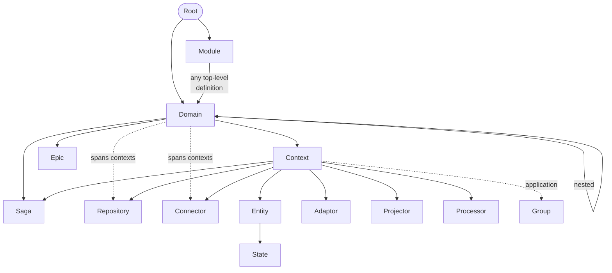
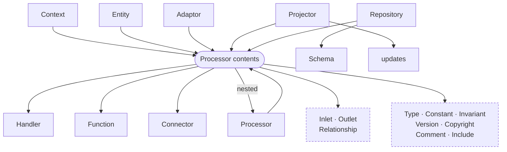
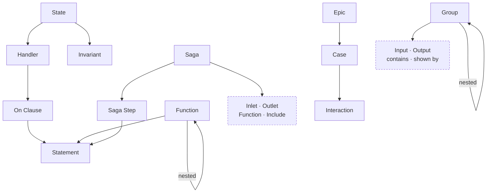

# Overview 
In this section we will explore the concepts and ideas that RIDDL uses. This is
not about the RIDDL language syntax, just the concepts of the language.

## Definitions
RIDDL consists only of [definitions](definition.md) that define the design of the desired system.  

## Definitional Hierarchy

Definitions in RIDDL are arranged in a hierarchy. Definitions that contain other
definitions are known as *branches*. Definitions that do not
contain other definitions are known as *leaves*.

This is done simply by having an attribute that lists the contents of any 
definition:

* _contents_: The contained definitions that define the container. Not all 
  definitions can contain other ones so sometimes this is empty.

### Simplifications
The valid hierarchy structure is shown below, but to make this hierarchy 
easier to comprehend, we've taken some short-cuts :

1. All the [common attributes](definition.md#common-attributes) 
   have been omitted for brevity but are implied on each line of the 
   hierarchy.
2. We only descend as far as a [Type](type.md) definition. 
   Whenever you see one, you should infer this hierarchy: 
  * [Types](type.md)
    * [Fields](field.md)

### Hierarchy

With those clarifying simplifications, here is the containment graph. It is a
*graph*, not a tree: several definitions are legal at more than one scope, and
four of them nest inside themselves. These three views split it up so each stays
readable; the [table below](#detailed-containment-reference) is the exhaustive
version.

**Where definitions live.** Dashed edges are conditional — a
[Repository](repository.md) or [Connector](connector.md) sits at domain scope
only when it genuinely spans several contexts, and a [Group](group.md) only in a
context with the `application` [intention](context.md#intention).

Note that [Saga](saga.md) and [Connector](connector.md) each have **two**
parents. A tree cannot say that, which is part of how the old diagram drifted.

**What every processor may contain.** RIDDL 2.0 unified the processors, so
rather than repeat one bundle of contents six times, it is drawn once. Everything
below the hub is legal inside *any* of the six above it.

**Behaviour and stories.** Where the pseudocode and the user-facing narrative
live. [Saga](saga.md) is the outlier that bears stream ports without being a
processor.

#### Detailed Containment Reference

| Container | Can Contain |
|-----------|-------------|
| [**Root**](root.md) | [Domain](domain.md), [Module](module.md), [Author](author.md), [Version](version.md), [Copyright](copyright.md), [Include](include.md), Import |
| [**Module**](module.md) | *any* top-level definition, flat and unordered |
| [**Domain**](domain.md) | [Type](type.md), [Epic](epic.md), [Context](context.md), [Domain](domain.md) (nested), [Saga](saga.md), [User](user.md), [Author](author.md), [Repository](repository.md)†, [Connector](connector.md)†, [Version](version.md), [Copyright](copyright.md), [Include](include.md), Import |
| [**Epic**](epic.md) | [Case](use-case.md) → [Interaction](interaction.md), [Type](type.md), `shown by`, [Include](include.md) |
| [**Context**](context.md) | [Entity](entity.md), [Projector](projector.md), [Saga](saga.md), [Adaptor](adaptor.md), [Repository](repository.md), [Processor](processor.md), [Connector](connector.md), [Group](group.md)‡, + *processor contents* |
| [**Entity**](entity.md) | [State](state.md), + *processor contents* |
| [**State**](state.md) | [Handler](handler.md), [Invariant](invariant.md) |
| [**Projector**](projector.md) | `updates`, + *processor contents* |
| [**Saga**](saga.md) | [SagaStep](sagastep.md) → [Statement](statement.md), [Inlet](inlet.md), [Outlet](outlet.md), [Function](function.md), [Include](include.md) |
| [**Adaptor**](adaptor.md) | *processor contents* |
| [**Repository**](repository.md) | Schema, + *processor contents* |
| [**Processor**](processor.md) | *processor contents* |
| [**Function**](function.md) | [Statement](statement.md), [Type](type.md), [Function](function.md) (nested), [Include](include.md) |
| [**Handler**](handler.md) | [On Clause](onclause.md) → [Statement](statement.md) |
| [**Group**](group.md) | [Group](group.md) (nested), `contains`, [Input](input.md), [Output](output.md), `shown by` |
| [**Invariant**](invariant.md) | a [Value](value.md) condition |

† at domain scope only when the definition genuinely spans several contexts
‡ only in a context with the `application` [intention](context.md#intention)

***Processor contents*** — every [processor](processor.md) may contain:
[Handler](handler.md), [Function](function.md), [Type](type.md),
[Constant](constant.md), [Invariant](invariant.md), [Inlet](inlet.md),
[Outlet](outlet.md), Relationship, nested [Processor](processor.md),
[Connector](connector.md), [Version](version.md), [Copyright](copyright.md),
[Comment](comment.md), [Include](include.md).

!!! info "New in RIDDL 2.0"
    Four concepts are new, and one changed shape:

    * [Module](module.md) — a flat, named collection of any top-level
      definition, which absorbed the deprecated *nebula*
    * [Version](version.md) — one component of a composed version coordinate
    * [Copyright](copyright.md) — a named notice, inherited nearest-first
    * [Standard Module](standard-module.md) — the predefined stream
      terminators every model can use without importing anything
    * [Processor](processor.md) — unified: every processor kind now bears
      ports and carries a shape derived from its arity

## Next
When you're done exploring all the concepts, check out our 
[guides](../guides/index.md) next.

## Full Index

The pages in this section cover each RIDDL concept in detail. Use the
navigation menu to explore individual concepts.
