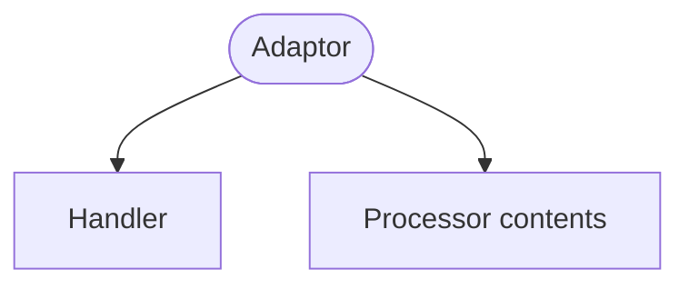

An adaptor's purpose is to _adapt_ one [Context](context.md)
to another [Context](context.md).  In Domain-Driven Design, 
this concept is known as an _anti-corruption layer_ that keeps the
ubiquitous language of one context from "corrupting" the language of another 
context.  The authors of RIDDL didn't like that term for a variety of reasons
so we have renamed the concept as _adaptor_ in RIDDL. Same idea, different name.

## Message Translation
Adaptors do their work at the level of messages sent between 
[Contexts](context.md). This is done using one or
more [Handlers](handler.md). Each handler specifies 
how messages are translated into other messages and forwarded to the target
[context](context.md).

## Target Context
Adaptors are only definable within a containing 
[Context](context.md) which provides one participant of the 
translation. The other [Context](context.md), known as the 
*target* context, is specified within the definition of the adaptor. 

## Adaptation Directionality
Adaptors only translate in one direction, between the containing context and 
the target context. However, multiple Adaptors can be defined 
to achieve bidirectional adaptation between
[Contexts](context.md). 
The directionality of an Adaptor is specified in the definition of the adaptor.
This leads to two kinds of adaptors: inbound and outbound.

!!! warning "One adaptor per direction, per pair of contexts"
    A context may adapt both **to** and **from** another context, but only
    **once in each direction**. Two adaptors with the same direction to the
    same foreign context split that context's translation across two places,
    with nothing to say which one handles a given message — an **Error**,
    because the ambiguity has no defensible resolution.

    Direction is part of the rule. Inbound *plus* outbound between the same
    pair is the sanctioned way to say "both ways", not duplication. And
    adaptors owned by *different* contexts are equally fine: A adapting from B
    while B adapts from A is two contexts each defending its own model.

## Inbound Adaptors
Inbound adaptors provide an adaptation that occurs from the 
[Context](context.md) referenced in the adaptor to the
[Context](context.md) containing the adaptor. 

## Outbound Adaptors
Outbound adaptors provide an adaptation that occurs from the
[Context](context.md) containing the adaptor to the
[Context](context.md) referenced in the adaptor.

## Syntax

The model below is **complete**: `riddlc validate` reports nothing on it with
every message class switched on. That is deliberate. An adaptor is easy to
show in isolation and easy to get subtly wrong that way — a port left out, a
connector that names the adaptor instead of its portlet, a `tell` with no
channel to travel — so this example carries everything the adaptors need to
be real: the ports they declare, the connectors that join them, the inlets the
far contexts declare to admit them, and a domain error sink. What happens to
an order *inside* Orders is written as prose (`do "…"`) because this page is
about the boundary, not the entity behind it; see [Entity](entity.md) for that.

<!-- riddl: standalone -->
```riddl
domain Shop is {
  author Reid is {
    name is "Reid Spencer"
    email is "reid@ossuminc.com"
  } with {
    briefly "The model's author"
    described as {
      |Wrote this example.
    }
  }

  type OrderId is UUID with { briefly "Identifies an order across every context" }

  external context Payments as source is {
    event PaymentCompleted is { orderId: OrderId } with {
      briefly "The payment provider took the money"
    }
    event PaymentFailed is { orderId: OrderId, reason: String } with {
      briefly "The payment provider declined"
    }
    type PaymentEvent is PaymentCompleted | PaymentFailed with {
      briefly "Everything Payments publishes"
    }
    outlet Outcomes is type PaymentEvent with {
      briefly "Where Payments publishes its outcomes"
    }
  } with {
    briefly "A third-party payment provider, outside the model"
    described as {
      |Modelled as external: we consume its events and never see its insides.
    }
  }

  context Orders as flow is {
    command MarkAsPaid is { orderId: OrderId } with { briefly "Record the payment" }
    command HandlePaymentFailure is { orderId: OrderId, reason: String } with {
      briefly "Record the failed payment"
    }
    command ReserveItems is { orderId: OrderId } with {
      briefly "Ask Inventory to hold this order's stock"
    }
    type PaymentInbound is MarkAsPaid | HandlePaymentFailure with {
      briefly "What the payment boundary lets in"
    }

    // An INBOUND adaptor addresses its OWN context, so this context needs an
    // inlet and a boundary handler. The context then dispatches inward by its
    // own rules -- the adaptor never names what is inside.
    inlet FromPayments is type PaymentInbound with {
      briefly "The payment boundary"
    }
    outlet Reservations is command ReserveItems with {
      briefly "Requests bound for the outbound Inventory adaptor"
    }
    handler OrdersBoundary is {
      on paid: command MarkAsPaid {
        do "Mark the order paid and start fulfilment"
        send command ReserveItems(paid.orderId) to outlet Reservations
      }
      on failed: command HandlePaymentFailure {
        do "Record the failure against the order and notify the customer"
      }
      on other { error "Unexpected message at the Orders boundary" }
    } with {
      briefly "Dispatches admitted payment messages inward"
    }

    adaptor PaymentAdapter from context Payments as flow is {
      inlet FromPayments is type Payments.PaymentEvent with {
        briefly "What Payments publishes"
      }
      outlet ToOrders is type PaymentInbound with {
        briefly "The translation, in Orders' vocabulary"
      }
      handler InboundPayments is {
        on paid: event Payments.PaymentCompleted {
          tell command MarkAsPaid(paid.orderId) to context Orders
        }
        on failed: event Payments.PaymentFailed {
          tell command HandlePaymentFailure(failed.orderId, failed.reason) to context Orders
        }
        on other {
          error "Unrecognized message from the Payments context"
        }
      } with { briefly "Translates payment outcomes into order commands" }
    } with {
      briefly "Translates payment messages from Payments into Orders' language"
      described as {
        |Inbound: it handles what Payments publishes and addresses its OWN
        |context, which then dispatches inward by its own rules.
      }
    }

    // The channel the inbound `tell` travels. Intra-context, so context scope
    // is right -- unlike the cross-context connectors at the end.
    connector PaymentTranslation is
      from outlet PaymentAdapter.ToOrders to inlet Orders.FromPayments with {
      briefly "The channel the inbound tell travels"
    }

    adaptor InventoryAdapter to context Inventory as flow is {
      inlet FromOrders is command ReserveItems with {
        briefly "What Orders asks of Inventory"
      }
      // A `tell` needs a modelled channel from the sender's OWN outlet to the
      // target's inlet; the domain-level connector joins this to Inventory.
      outlet ToInventory is command Inventory.ReserveStock with {
        briefly "The request, in Inventory's vocabulary"
      }
      handler OutboundInventory is {
        on req: command ReserveItems {
          tell command Inventory.ReserveStock(req.orderId) to context Inventory
        }
        on other {
          error "Unrecognized outbound message"
        }
      } with { briefly "Translates reservation requests into Inventory's language" }
    } with {
      briefly "Translates inventory requests from Orders to Inventory"
      described as {
        |Outbound: it handles Orders' own command and addresses the FAR context.
      }
    }

    connector InventoryRequests is
      from outlet Orders.Reservations to inlet InventoryAdapter.FromOrders with {
      briefly "Orders hands reservation requests to its outbound adaptor"
    }
  } with {
    briefly "Customer orders"
    described as {
      |Owns the order lifecycle and defends its vocabulary at two boundaries.
      |What happens to an order inside is prose here; this model is about the
      |boundaries.
    }
  }

  context Inventory as sink is {
    command ReserveStock is { orderId: OrderId } with {
      briefly "Hold stock for an order"
    }
    // An adaptor may address only a CONTEXT, and that context must declare an
    // inlet ADMITTING the message (adaptor-target-no-admitting-inlet).
    inlet FromOrders is command ReserveStock with {
      briefly "The boundary Orders addresses"
    }
    handler InventoryBoundary is {
      on req: command ReserveStock {
        do "Hold the stock this order needs"
      }
      on other { error "Unexpected message at the Inventory boundary" }
    } with { briefly "Receives reservation requests" }
  } with {
    briefly "Stock on hand"
    described as {
      |Holds and releases stock on behalf of orders.
    }
  }

  context Operations as sink is {
    inlet Errors is record Riddl.GeneratorError with {
      option is error-sink
      briefly "Where anything unrecoverable ends up"
    }
  } with {
    briefly "Operational plumbing"
    described as {
      |The destination for hard errors raised anywhere in Shop.
    }
  }

  // Cross-context connectors sit at DOMAIN scope: inside either context they
  // would be under-scoped (stream-crosses-contexts). Each endpoint names a
  // PORTLET, never the adaptor itself (ref-wrong-kind).
  persistent connector PaymentOutcomes is
    from outlet Payments.Outcomes to inlet Orders.PaymentAdapter.FromPayments with {
    briefly "Payments' outcomes cross into Orders through its inbound adaptor"
  }
  persistent connector OrdersToInventory is
    from outlet Orders.InventoryAdapter.ToInventory to inlet Inventory.FromOrders with {
    briefly "Orders' requests cross into Inventory from its outbound adaptor"
  }
  connector ErrorsToSink is
    from outlet Riddl.ForeverEmpty.void to inlet Operations.Errors with {
    briefly "No modelled component emits a GeneratorError; generators do"
  }
} with {
  briefly "A shop with an external payment provider"
  described as {
    |Three contexts and the two adaptors that keep their vocabularies apart.
  }
}
```

Note the operand order: `tell <message> to <processor>`, not the reverse.

## The Adaptor Is the Boundary

An adaptor is not merely *allowed* at a context boundary — for the ordered pair
of contexts and the direction it declares, it **is** that boundary. Five rules
follow, and together they are the largest change to streaming semantics since
2.0.

### It may address only a Context

A `tell`, `send` or `forward` inside an adaptor must name a **context** — or a
context's own portlet. Naming an entity, repository, projector or streamlet is
an Error: `adaptor-targets-context-only`.

This does **not** follow from the isolation seam below, which is why it needs
saying separately. The seam governs what *crosses* a context and leaves
intra-context sends alone, so an adaptor telling an entity of its own context
satisfies it — and that is exactly what most models used to do.

The reasoning is that the adaptor is the one processor for which the boundary
is not a constraint on its work but *is* its work. Reaching inward to a named
entity makes it a participant in that context's business rather than its
translator, and it binds the foreign message's shape to one processor inside
this one.

### Both directions address a context

There is no third form, and no port name appears in either:

| Direction | Addresses | Resolved against |
|---|---|---|
| **Outbound** (`to context B`) | the **far** context | a portlet *B* declares |
| **Inbound** (`from context B`) | its **own** context | its own declared inlet |

Inbound, the context then dispatches inward by its own rules — which is the
isolation seam expressed as syntax rather than as a prohibition, since the
foreign vocabulary appears on exactly one side of each clause.

### The target context must declare an admitting inlet

An adaptor may address a context only where that context declares an inlet
admitting the message type. Otherwise:
`adaptor-target-no-admitting-inlet`. The boundary has to be **modelled**, not
implied.

### Ports are declared, and a missing one is incomplete

An adaptor's ports are **declared**, exactly like every other processor's.
Nothing is implied by its direction: a port-less adaptor is `void` by arity,
not a `flow`, and an adaptor takes whatever shape its ports give it — two
inlets and an outlet make a legal `merge`. An `as <shape>` ascription is
checked against the declared arity as it is for any processor.

A connector endpoint names a **portlet** —
`from outlet Orders.PaymentAdapter.ToOrders` — never the adaptor itself.
`from outlet Orders.PaymentAdapter` is an Error, `ref-wrong-kind`: the path
resolves to an Adaptor where an Outlet was expected.

What an adaptor's handlers **do** decides which ports it **owes**. One whose
clauses receive messages but declares no inlet, or whose clauses `tell`,
`send` or `forward` but declares no outlet, is **incomplete** — the same fact
a `???` body states, and reported the same way, as a **Missing** warning that
names the types so you know what to write. Delete `PaymentAdapter`'s inlet
from the model above and this is what you get:

```text
[missing] [stream-processor-no-inlet]
Adaptor 'PaymentAdapter' is incomplete: it handles Event 'PaymentCompleted',
Event 'PaymentFailed' but declares no inlet to receive them on
```

Every processor kind gets this rule; only the id spelling varies. An
**entity** reports `entity-no-inlet` / `entity-no-outlet`, ids that were
published before the rule was generalised and are kept because a published
code means the same thing forever. Every other kind — adaptor, context,
projector, repository, streamlet — reports `stream-processor-no-inlet` /
`stream-processor-no-outlet`.

The other half of the rule is what keeps it from being a second demand: **a
rule abstains on the side it cannot read.** Until the inlet is declared,
nothing judges the shape ascription or asks whether a foreign message is
admitted; until the outlet is declared, nothing asks whether a `tell` is
reachable. A port-less adaptor that tells draws the one Missing warning, not
that plus an unreachable-target Error, because there is nothing to say about
a graph whose edges are not yet written.

!!! note "This reverses an earlier design"
    For five days in September 2026, an adaptor's two ports were *implied* by
    its direction, so every port-less adaptor was a `flow` and
    `adaptor-implied-outlet-ambiguous` complained when the implied outlet
    would have needed several types. That was withdrawn: the implication was
    invisible to the rules that read a processor's ports, so one omission
    surfaced as two contradictory diagnostics, and it made adaptors the one
    processor with an exception to learn. The rule id is retired. If you see
    it in older output, declare the outlet with an alternation, as
    `PaymentInbound` does above — which is the same remedy, and now the only
    one.

### Exclusivity: no going around it

Where a context declares an outbound adaptor toward another, a connector that
runs from that context's own outlet straight into the target is an Error, and
it names the adaptor you are bypassing:
`stream-connector-bypasses-adaptor`. An adaptor that can be routed around is
not a boundary.

!!! note "Why the near hop may be free at run time"
    The adaptor's port toward its **own** context, and the connector joining
    them, are a *modelling* device. A generator is free to fuse them into a
    direct in-process call — an adaptor and its context share a memory space,
    and translation is not worth a channel of its own.

    **The fusion stops at the boundary.** The hop to the *far* context stays a
    real message on a real channel, durable by default. Fusing the near hop
    also costs independent scalability of the adaptor, so it is a deployment
    choice taken knowingly, never something a model may assume.

## The Isolation Seam

An adaptor bridges **exactly two** contexts: the context that contains it, and
the `referent` context named in its declaration. It is the only sanctioned
crossing point between contexts, so it must not traffic in a **third**
context's messages.

!!! warning "Validation"
    **Errors:**

    - A message whose owning context is neither the parent nor the referent.
      This applies both to the message an `on` clause consumes and to every
      `send`/`tell` target it emits, including those nested inside `when`,
      `match` and `foreach` bodies.
    - A handler with no `on other` clause. An adaptor must say explicitly what
      it does with messages it does not recognize, rather than discarding them
      silently.

    Types defined at [domain](domain.md) or [root](root.md) level are shared
    vocabulary common to both sides and are never flagged.

!!! info "Why only adaptors are held to `on other`"
    `on other` is a fall-through, not a duty: for most processors the general
    rule is *"nothing to do, omit the clause"*, and a proposal to require it
    everywhere was **declined** in 2026-08-14. About two thirds of the handlers
    in `riddl-models` carry one, which is a healthy majority rather than a
    universal.

    An adaptor is the exception because for a translator there is never
    nothing to do. It exists to translate **everything** crossing the seam —
    including messages it was not designed for, where the translation is
    "I cannot translate that". Doing nothing with an unrecognized message is
    to drop a turn in a conversation between two contexts, silently, with the
    far side still waiting. So the adaptor rule is an *application* of the
    general one, not an exception to it.

## Options

`circuit-breaker` (0–2 arguments) is valid on an adaptor, tripping the
adaptation when the far side is failing.

## When to Use Adaptors

Use an adaptor when:

- **Contexts have different vocabularies**: The same concept has different
  names or structures in each context
- **You need to protect domain integrity**: Prevent external concepts from
  leaking into your bounded context
- **Contexts evolve independently**: Changes in one context shouldn't force
  changes in another
- **Integration with external systems**: Translate between your domain model
  and external APIs

**Example scenario**: Your Orders context tracks "line items" while the
Inventory context uses "stock reservations". An adaptor translates between
these models so neither context needs to know about the other's terminology.

## Adaptor vs. Direct References

| Approach | When to Use |
|----------|-------------|
| **Adaptor** | Contexts have different models, need translation |
| **Direct reference** | Contexts share the same model, tightly coupled by design |

## Occurs In
* [Contexts](context.md)
* [Modules](module.md)

## Contains



* [Handler](handler.md) — the translation rules
* Everything a [processor](processor.md) may contain: [Type](type.md), [Constant](constant.md), [Invariant](invariant.md), [Function](function.md), [Handler](handler.md), [Streamlet](streamlet.md), nested [Processor](processor.md), [Connector](connector.md), Relationship, [Inlet](inlet.md), [Outlet](outlet.md), [Version](version.md), [Copyright](copyright.md), [Comment](comment.md)
* [Include](include.md)

