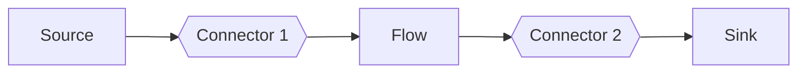

<!-- riddl-prelude
event Order is { id is String }
event OrderEvent is { id is String }
event RawOrder is { id is String }
processor OrderEventSource as source is { outlet OrderEvents is type OrderEvent }
processor OrderEnricher as sink is { inlet RawOrders is type OrderEvent }
processor Home as sink is { inlet incoming is type Order }
processor Abroad as sink is { inlet incoming is type Order }
-->

# Connector

Connectors are uni-directional conduits for reliably transmitting data of a
particular [type](type.md). A connector joins exactly one
[outlet](outlet.md) to exactly one [inlet](inlet.md).

<!-- riddl: in-context -->
```riddl
connector OrderFlow is
  from outlet OrderEventSource.OrderEvents
  to inlet OrderEnricher.RawOrders
with {
  briefly as "Connects the order source to enrichment"
}
```

## Data Transmission Type

A connector transmits one data type. The transmission type is often an
[alternation](type.md#alternation) of [messages](message.md), such as the
commands and queries an [entity](entity.md) might receive.

The outlet's type and the inlet's type must be compatible. A port typed
`Anything` is compatible with every other type — which is what lets the
[standard module's](standard-module.md) universal terminators accept any
stream.

## Port Cardinality

**Exactly one connector may attach to any given port.**

Fan-in and fan-out are modeled by declaring **multiple ports** — the arity is
what derives a `merge` or `split` [shape](processor.md#shape) — never by
attaching several connectors to a single port.

<!-- riddl: in-context -->
```riddl
// Correct: a split declares two outlets, each with its own connector
processor Router as split is {
  inlet incoming is type Order
  outlet domestic is type Order
  outlet international is type Order
}
connector ToDomestic      is from outlet Router.domestic      to inlet Home.incoming
connector ToInternational is from outlet Router.international to inlet Abroad.incoming
```

Attaching more than one connector to a port is an **Error**.

## Scope

A connector may be declared in a [Context](context.md) or, when its two ends
are in different contexts, in the enclosing [Domain](domain.md).

!!! warning "Placement validation"
    Both ends are resolved, and their owning contexts and domains compared:

    - **Error** — the ends resolve to different **domains**. A stream edge
      across a domain boundary is a failure of domain analysis, not something
      to wire around.
    - **Error** — a domain-scoped connector whose ends share one context. It is
      over-scoped; move it into that context.
    - **Error** — a context-scoped connector whose ends cross contexts. It is
      under-scoped; promote it to domain scope.
    - **CompletenessWarning** — a domain-scoped connector that **crosses**
      between two different contexts without the `persistent` option.
      Durability at a context boundary can be model correctness, not merely a
      deployment concern. A connector with both ends inside the *same*
      external context crosses nothing and is not asked for it.
    - **Error** — a cross-context connector that reaches **past** a boundary.
      Each end must land on the context's **own** portlet: the source context's
      outlet, the target context's inlet.

    These checks are conservative: they only fire when both ends resolve.

!!! info "Crossing out, and staying in"
    A [context](context.md) publishes a public API — its message set — while
    its representations stay private. A cross-context connector wired to a
    contained [entity](entity.md)'s inlet binds a peer to that entity's
    existence and current command set, so the entity can no longer change
    without breaking a stranger. That is why reaching past the boundary is an
    Error rather than advice.

    **Inside** a single context, none of this applies: any processor,
    streamlet or connector may communicate with any other, and a connector may
    drive a contained entity's inlet directly.

    Nothing requires a dedicated `sink` or `source` streamlet to make this
    work. An **entity is a streamlet** — it may carry its own inlets and
    outlets and needs nothing from its context to process messages. A
    **context is a streamlet** too: given an inlet and handlers, *the context
    is the sink*. Crossing out of a context, the context is the source;
    crossing in, it is the sink.

!!! warning "A processor uses its OWN ports"
    A message reaches a processor through **that processor's** inlet — not a
    sibling's, and not its container's. Likewise it publishes through its own
    outlet: a projector's inlet does not make an entity reachable, and an
    entity cannot publish on its context's outlet.

    Getting a message out of an entity therefore runs *entity outlet →
    connector → context inlet → handler → context outlet*, and the first step
    is the entity's own outlet. An entity that handles messages but declares no
    inlet, or emits messages but declares no outlet, draws a
    CompletenessWarning. A `???` stub is exempt.

## Options

Connector options are advice to the translators converting a connector into
something else. A connector often plays a large part in a reactive system's
resilience, so several are available.

| Option | Arguments | Meaning |
|--------|:---------:|---------|
| `persistent` | 0 | Messages are persisted to stable, durable storage, so they survive failure or shutdown |
| `ordered` | 0 | Delivery preserves order |
| `unordered` | 0 | Delivery order is not significant, enabling partitioning and parallelism |
| `at-least-once` | 0 | Each item is delivered one or more times; handlers must be idempotent |
| `at-most-once` | 0 | Each item is delivered zero or one times; loss is possible |
| `exactly-once` | 0 | Each item is delivered precisely once |
| `partitioned` | 1 | Data is partitioned by a key so a consumer group can process it in parallel |
| `circuit-breaker` | 0–2 | Trip the connection when the downstream is failing |

### `persistent`

Messages flowing through the connector are persisted to stable, durable
storage, so they cannot be lost even if the system fails or shuts down. This
arranges a kind of
[bulkhead](https://learn.microsoft.com/en-us/azure/architecture/patterns/bulkhead)
that retains published data despite failures on either end.

Removing the burden of persistence is likely to make a connector considerably
more performant, since storage latency is no longer involved — which is why it
is opt-in rather than the default.

!!! info "Why ordering is an option when persistence is not"
    The default is **ordered**; `unordered` is *permission, not mandate* —
    best-effort unordered delivery, with ordered delivery remaining a
    conforming implementation. A generator may decline to honour it and still
    conform, which is exactly why ordering stayed an **option**.

    Persistence and delivery guarantees fail that test: a delivery guarantee is
    not something a generator may quietly decline. That is the line between an
    option and an intention.

### Delivery semantics

`at-least-once` requires the implementation to make handling idempotent, so
that running an item twice has the same effect as running it once.
`at-most-once` relaxes that to best-effort, which may increase throughput and
lower overhead where data loss is not catastrophic — some IoT systems permit it
because the next transmission is imminent.

## Producers and Consumers

Attached to the ends of connectors are producers and consumers. These are
[processors](processor.md) that may originate, terminate, or flow data through
them, joining two connectors together.



Because each port takes exactly one connector, a processor that must serve
several downstream consumers does so by declaring several outlets — becoming a
`split` — rather than by sharing one outlet among several connectors.

## Occurs In

* [Contexts](context.md)
* [Domains](domain.md) — when the two ends are in different contexts

## Contains

Nothing
