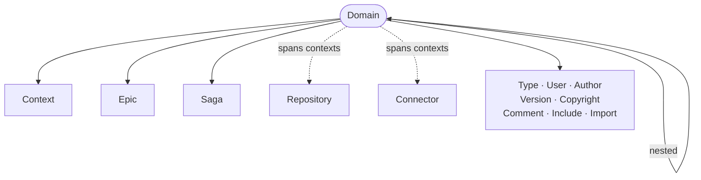

A domain is the top-most definitional level in RIDDL. We use the word 
*domain* in the sense of a *knowledge domain*; like an entire business, a 
field of study, or some portion of these. It has nothing to do with Internet 
domain names. A domain is an arbitrary boundary around some subset of concepts
in the universe. As with Domain Driven Design, RIDDL uses the concept of a
domain to group together a set of related concepts.

Domains in RIDDL are inert. That is they only serve to contain definitions 
that do things, but they don't do things themselves.

Domains can recursively contain other nested domains so that a hierarchy of 
domains and subdomains is established.  Because of this, we can organize any
large, complex knowledge domain or field of study, into an
[hierarchical ontology](https://en.wikipedia.org/wiki/Ontology#Flat_vs_polycategorical_vs_hierarchical).

For example, if you were modelling the domain of *Two Wheeled Vehicles* you
might devise a domain hierarchy like this:
* Two Wheeled Vehicle
    - Motorized
      - ICE powered motorcycles
      - Scooter
      - Electric Bicycles
      - Segway 
  * UnMotorized
    * Bicycles
    * Oxcart
    * Handtruck
    * Human With Training Wheels

## Cross-Context Definitions

Domains are inert, but two definitions may live at domain scope precisely
because they *span* the contexts beneath it:

- A [Repository](repository.md) that synthesizes data from entities in several
  contexts, and is queried by several contexts
- A [Connector](connector.md) whose two ends are ports in different contexts

Both are validated for correct scope. A domain-scoped repository that reaches
only one context is an **Error** — it is provably unnecessary there. A
context-scoped connector whose ends cross contexts is likewise an Error, and so
is the reverse.

## Authorship and Attribution

A domain is one of only two places an [author](author.md) may be *defined*
(the other is a [Module](module.md)); everywhere else, authors are referenced
with `by author Name`. A domain may also declare a [version](version.md) and a
[copyright](copyright.md).

!!! warning "Validation"
    A domain that identifies no author — considering its own author references
    and defined authors, as well as those of any enclosing domain — draws a
    **MissingWarning**. It is suppressible through the existing missing-warning
    gates.

## Occurs In

* [Root](root.md)
* [Modules](module.md)
* [Domains](domain.md) :material-recycle: — domains
  can be nested in a super-domain

## Contains

* [Context](context.md) — the bounded contexts of the domain
* [Domain](domain.md) :material-recycle: — nested subdomains
* [Epic](epic.md) and [Saga](saga.md)
* [Repository](repository.md) and [Connector](connector.md) — *only* when they genuinely span several contexts
* [Type](type.md), [User](user.md), [Author](author.md), [Version](version.md), [Copyright](copyright.md), [Comment](comment.md)
* [Include](include.md) and `import` directives

