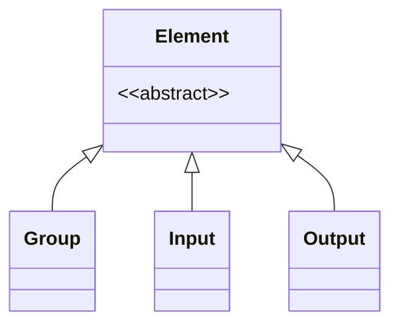

<!-- riddl-prelude
type Clicked is Boolean
-->

# Element

*Elements* are the definitions that define the user interface for an
[application](application.md). Every element is associated 
with a data [type](type.md) for either input or output. 
Users are either sending information to inputs or receiving information
from outputs. 

## Element Types
There is one RIDDL definition for each of the four typical categories of 
User Interface elements[^1] as shown in the table below

[^1]: See [Critical UI Elements of Remarkable Interfaces](https://www.peppersquare.com/blog/4-critical-ui-elements-of-remarkable-interfaces/) 

### Group

A Group organizes related UI elements together, similar to a panel or section
in traditional user interfaces. Groups can contain other elements including
nested groups, enabling hierarchical organization of the user interface.

Groups have many aliases in RIDDL to accommodate different UI paradigms:
`group`, `page`, `pane`, `dialog`, `menu`, `popup`, `frame`, `column`,
`window`, `section`, `tab`, `flow` and `block`.

### Input

An input takes data *from* the user. It is written as an input alias, a name,
an **acquisition verb**, and the type acquired:

`input`, `form`, `text`, `button`, `picklist`, `selector`, `item`

The acquisition verbs are interchangeable — pick whichever reads best:

`acquires`, `reads`, `takes`, `accepts`, `admits`, `enters`, `provides`,
`selects`, `chooses`, `picks`, `initiates`, `submits`, `triggers`,
`activate`, `activates`, `starts`

### Output

An output presents data *to* the user, written as an output alias, a name, a
**presentation verb**, and what is presented:

`output`, `document`, `list`, `table`, `graph`, `animation`, `picture`

Presentation verbs: `presents`, `shows`, `displays`, `writes`, `emits`

## Navigation

There is **no** `activate` definition. Navigation is expressed as an input
whose acquisition verb conveys the action — most naturally a `button` with
`activates` or `triggers`:

<!-- riddl: in-group -->
```riddl
button Checkout activates type Clicked
```

Both `activate` and `activates` are accepted, as are the other acquisition
verbs — pick whichever reads best at the call site.

## Occurs In
* [Group](group.md)

## Contains

*Element* is **abstract** — a class name in the AST, like *Node*, not a RIDDL
keyword you can write. Nothing is "an element" in source; a thing *is* a
[Group](group.md), an [Input](input.md) or an [Output](output.md), and those
three are what the term covers.

So the relationship below is *is-a*, not containment:



Of the three, only [Group](group.md) contains anything:

* [Group](group.md) — nested groups, [Inputs](input.md) and
  [Outputs](output.md)
* [Input](input.md) and [Output](output.md) — each **references** a
  [type](type.md) rather than containing one

