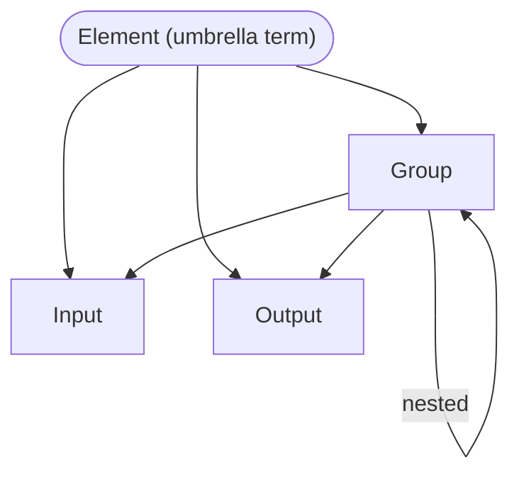

# Element

*Elements* are the definitions that define the user interface for an
[application](application.md). Every element is associated 
with a data [type](type.md) for either input or output. 
Users are either sending information to inputs or receiving information
from outputs. 

## Element Types
There is one RIDDL definition for each of the four typical categories of 
User Interface elements[^1] as shown in the table below

[^1]: See [Critical UI Elements of Remarkable Interfaces](https://www.peppersquare.com/blog/4-critical-ui-elements-of-remarkable-interfaces/) 

### Group

A Group organizes related UI elements together, similar to a panel or section
in traditional user interfaces. Groups can contain other elements including
nested groups, enabling hierarchical organization of the user interface.

Groups have many aliases in RIDDL to accommodate different UI paradigms:
`group`, `page`, `pane`, `dialog`, `menu`, `popup`, `frame`, `column`,
`window`, `section`, `tab`, `flow` and `block`.

| UI Element | RIDDL    | Description                                  |
|------------|----------|----------------------------------------------|
| Input      | Give     | input of data items to fill an aggregate     |
| Input      | Select   | select item(s) from a list                   |
| Output     | View     | presents a data value for consideration      |
| Navigation | Activate | cause the application to change its context  |
| Container  | Group    | groups elements together                     |

## Activate

An Activate definition instructs the application to change context to a
different group of elements, enabling navigation within the application.

## Occurs In
* [Group](group.md)

## Contains

*Element* is an umbrella term rather than a RIDDL keyword: it names the three
definitions that make up a user interface. Only [Group](group.md) contains
anything.

* [Group](group.md) — the only one that contains other elements: nested groups,
  [Inputs](input.md) and [Outputs](output.md)
* [Input](input.md) and [Output](output.md) — each **references** a
  [type](type.md) rather than containing one

