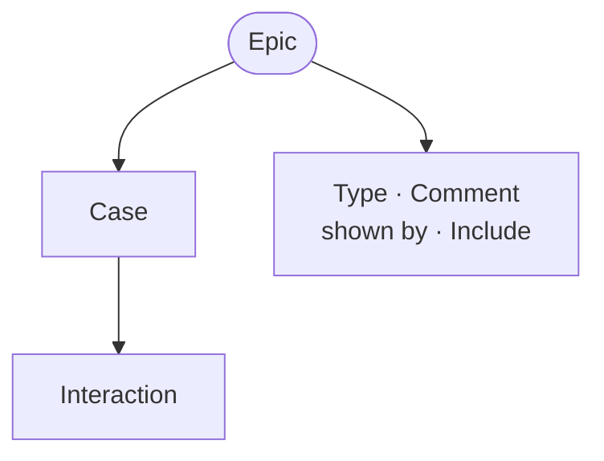

An epic in RIDDL is a definition that defines a large user story with a set
of use cases. This is the same concept as the idea 
[Kent Beck](../introduction/who-made-riddl-possible.md#kent-beck) 
[introduced in 1997](https://en.wikipedia.org/wiki/User_story#History). In 
RIDDL, a story gets a little more involved than the 
[usual formulations](https://en.wikipedia.org/wiki/User_story#Common_templates) 
of a user story:
> As a _{user}_, I would like _{capability}_, so that _{benefit}_

or

> In order to receive _{benefit}_, as a _{user}_, I can _{capability}_

which have these three ideas:
* A `user` that provides the role played by the narrator of the story
* A `capability` that provides the capability used by the narrator
* A `benefit` that provides the reason why the narrator wants to 
  use the `capability`

A RIDDL Epic also provides a set of use cases that relate the story to
other RIDDL components through the steps taken for each
[case](use-case.md). Each case specifies a set of
`interactions` that define and label the interactions between other RIDDL
definitions such as
[elements](element.md),
[entities](entity.md), and
[projectors](projector.md).
Cases can also outline user acceptance testing.

Stories are designed to produce sequence diagrams. This allows the intended
interaction of some user (human or not) with the system being
designed in RIDDL to support a detailed definition of a
[user story](https://en.wikipedia.org/wiki/User_story).

## Syntax

<!-- riddl-domain-prelude
user Customer is "a shopper using the store"
-->
<!-- riddl: in-domain -->
```riddl
epic ShoppingCartEpic is {
  user Customer wants to "add items to a shopping cart"
  so that "they can purchase multiple items at once"

  case AddingToCart is {
    user Customer wants to "add an item to the cart"
    so that "it is included in the order"
    ???
  }
} with {
  briefly as "User stories about shopping cart management"
}
```

Every `case` opens with its own user story, and its body may be left `???`
until the interactions are written — but it cannot be empty.

### Modal Verbs

RIDDL 2.0 widens the user-story verb from `wants` alone to a modal set:

`wants`, `must`, `shall`, `should`, `may`, `will`, `can`

<!-- riddl: in-epic-story -->
```riddl
user Customer must  "authenticate" so that "their account is protected"
user Auditor  should "review the ledger" so that "discrepancies are caught"
user Guest    may   "browse without an account" so that "they can evaluate us"
```

This is **vocabulary only**. All variants parse to the same structure, so the
modality reads naturally but is not captured as data — a model cannot be
queried for its "must" stories. Recording modality as MoSCoW priority would be
a separate feature, and was deliberately not done here.

The `to` after the verb remains optional, as it always was.

## Options

`sync` marks an epic whose interactions are synchronous.

## Occurs In
* [Domains](domain.md)
* [Modules](module.md)

## Contains



* [Use Case](use-case.md) — each a named path through the story
* [Type](type.md), [Comment](comment.md), `shown by`, [Include](include.md)
* Its user story is part of the epic's own declaration, not a contained definition

