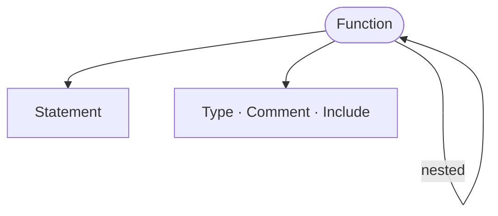

<!-- riddl-prelude
type Price is Natural
record TotalInputs is { subtotal is Price }
record TaxInput is { subtotal is Price }
function Tax is {
  requires record TaxInput returns Price
  function Apply is { requires record TaxInput returns Price ??? }
}
record PricingInput is { subtotal is Price, taxRate is Price }
function Pricing is {
  requires record PricingInput returns Price
  function CalculateTotal is { requires record PricingInput returns Price ??? }
}
-->

A function definition provides a way to not repeat yourself in 
other definitions. We can define functions in several places and then use 
them in an expression or action. This way, we only need to define the logic 
for something once.

## Signature

A function's `requires` and `returns` may name an existing [type](type.md)
rather than spelling out an inline aggregation, which makes unary and nullary
functions natural to write:

<!-- riddl: in-context -->
```riddl
function CalculateTotal is {
  requires record TotalInputs
  returns Price

  return call function Tax.Apply(subtotal)
}
```

Any type works, and the kind keyword is optional: `requires Age`,
`requires type Age` and `requires record Args` are all valid.

!!! warning "The inline aggregation form is deprecated"
    <!-- riddl: skip reason="deliberate counter-example: the inline aggregation form emits [deprecated], which the gate treats as failure" -->
    ```riddl
    requires { subtotal is Price, taxes is Price }   // still works
    ```
    It continues to parse and validate but emits a `[deprecated]` message.
    Name a type instead.

## Functions Must Be Pure

A function body may **not** write entity state (`set`, `morph`, `become`), nor
`send`, `tell` or `yield`. This is enforced at **parse** time, so an effect
statement can never enter a function's AST at all.

What remains legal is refusal (`require`, `error`) and pure computation
(`let`, `when`, `match`, `foreach`, `do`, `return`, embedded code blocks).

Purity is what makes a function safe to `call` from anywhere — a handler body
or another function — with no scope gate and no ordering concern.

## Calling a Function

`call` is a [value](value.md) expression rather than a bare statement, because
a pure function's result would otherwise be discarded:

<!-- riddl: in-handler -->
```riddl
let total = call function Pricing.CalculateTotal(subtotal, taxRate = rate)
set field grandTotal to call function Tax.Apply(total)
```

Arguments are positional first, then named, and are bound to the function's
`requires` fields. Calling a function that declares no `returns` is an
**Error**.

## Occurs In
* Any [processor](processor.md) — [contexts](context.md),
  [entities](entity.md), repositories, projectors, adaptors, streamlets
* [Modules](module.md)

## Contains



* [Statement](statement.md) — the pseudocode body
* [Function](function.md) :material-recycle: — nested helper functions
* [Type](type.md), [Comment](comment.md), [Include](include.md)
* Its input and output are declared in the signature, not contained

