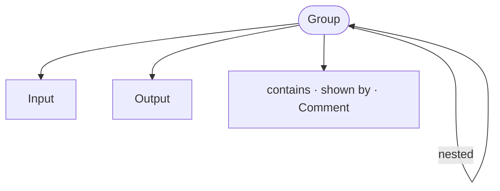

<!-- riddl-prelude
record CartLine is { sku is String, quantity is Natural }
type Clicked is Boolean
-->

A group is the abstract structuring concept for an application. Groups can be 
nested which allows them to form a hierarchy that defines the structure of a 
user interface. Each group can also contain UI elements such as 
[inputs](input.md) and
[outputs](output.md) as well as [types](type.md).
To make this more tangible, groups could be used to model the following 
implementation concepts:
* HTML forms, pages, containers, and sections
* mobile application screens, pages, forms and containers
* accordions (vertically stacked list of items with show/hide functionality)

A UI designer is free to arrange the contained
elements in any fashion, but presumably in a way that is consistent with
their overall UI design theme.

## Aliases

A group may be written with any of these keywords, all of which mean the same
thing structurally. Pick whichever reads best for what you are modeling:

`group`, `page`, `pane`, `dialog`, `menu`, `popup`, `frame`, `column`,
`window`, `section`, `tab`, `flow`, `block`

<!-- riddl: in-app-context -->
```riddl
page ShoppingCart is {
  list Items shows type CartLine
  button Checkout activates type Clicked
}
```

!!! warning "Groups require an application context"
    A group — under any of its aliases — may only appear in a
    [Context](context.md) declared with the `application`
    [intention](context.md#intention). A group in any other context is a hard
    **Error** as of RIDDL 2.0. In 1.x, any context containing a group was
    treated as an application.

## Design References

A group may carry a [figma reference](metadata.md#figma-references) linking it
to the exact frame that depicts it:

<!-- riddl: in-app-context -->
```riddl
page Checkout is { ??? } with {
  figma "aBcD1234" node "42:1337"
}
```

## Occurs In
* [Application](application.md) contexts
* [Group](group.md)

## Contains



* [Group](group.md) :material-recycle: — nested groups, and `contains` references to groups defined elsewhere
* [Input](input.md) and [Output](output.md)
* `shown by`, [Comment](comment.md)

