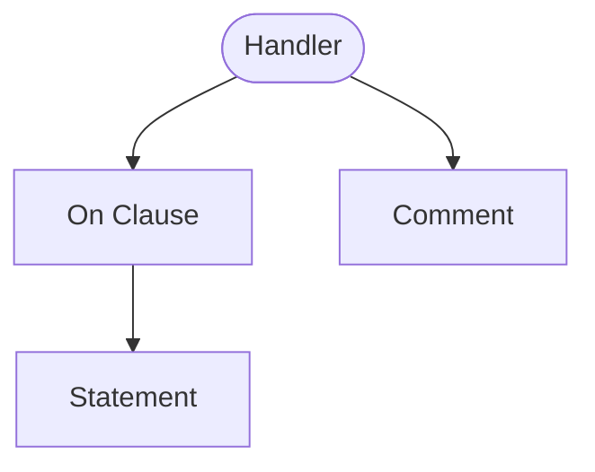

<!-- riddl-prelude
record PendingData is { note is String }
record ShippedData is { trackingNumber is String }
record ActiveOrderData is { total is Natural }
record ShippedOrderData is { trackingNumber is String }
command ShipOrder is { trackingNumber is String }
entity Order is {
  initial state PendingOrder of record PendingData is {
    handler PendingOrderHandler is { on command ShipOrder { ??? } }
  }
  state ShippedOrder of record ShippedOrderData is {
    handler ShippedOrderHandler is { on command ShipOrder { ??? } }
  }
}
-->

A *handler* is a very important definition in RIDDL because it is RIDDL's 
way of expressing both business logic and relationships between the various
components in a model. Handlers do that by specifying what should be done 
whenever a [message](message.md) of a particular type is
received by its parent definition. Handlers are composed as a set of
[on clauses](onclause.md) that connect a
[message](message.md) with a set of
[statements](statement.md). The statements provide the business 
logic that should be executed upon receipt of the message. Because that business 
logic can send and publish further messages to other components, a 
relationship can be inferred between the component receiving the message 
and the component that contains the handler.

There are several kinds of handlers depending on the handler's containing
definition, as shown in this table:

| Occurs In   | Handler Focus                                                    |   
|-------------|------------------------------------------------------------------|
| Adaptor     | Translate messages between [contexts](context.md) |
| Application | Handling the messages received from the user                     |
| Context     | Implements API of the stateless context                          |
| Entity      | Handler to use on new entity before any morph action             |
| Processor   | Provide ETL logic for moving inputs to outputs                   |
| Projector   | Handle events, building the projection                           |
| Repository  | Handle updates and queries on the repository                     |
| State       | Handle messages while entity is in that state                    |

The types of definition in which Handlers occur are known as the 
"active" definitions. More details are provided in the sections below. 

## Adaptor Handlers
Adaptor handlers provide the translation of messages from one
[context](context.md) to another.

## Application Handlers
Application handlers process the events generated by the Application's user 
to invoke business logic that typically results in sending further messages 
to the "back end" (typically a *gateway* context). This allows the 
application to be connected to the rest of the model. 

## Context Handlers
Context handlers imply a stateless API for the context, perhaps 
encapsulating the other things defined within the 
[context](context.md).

## Entity Handlers
Entity handlers specify the default or "catch all" handler for an entity.  
When the entity is new, or is not in a specific state, this default handler 
is used to process each message. If the message is not processed by the handler,
then the entity's processing for that message is null (message ignored).
When an entity is in a specified state, it processes messages defined by 
the handler within that state (see below).

## Projector Handler

Projector handlers process events to build and maintain read-side views of
data. They receive events from the event stream and update the projection's
state accordingly.

!!! warning "Projectors are event-only"
    As of RIDDL 2.0 a projector handler may contain `on event` and `on result`
    clauses only. `on command`, `on query` and `on record` are rejected at
    parse time. Queries against the projected data are served by the
    [repository](repository.md) the projector `updates`, not by the projector
    itself.

## The `initial` Marker

An optional `initial` keyword marks which handler is live when nothing has
selected one yet. It means different — though related — things at the two
placements a handler can occupy.

### On a State Handler

`initial` marks the handler that becomes active when the entity transitions
**into** that state, whether by [morph](statement.md#morph-and-become-entity-only)
or at creation:

<!-- riddl: in-entity -->
```riddl
state Pending of record PendingData is {
  initial handler PendingHandler is { ??? }
  handler AuditHandler is { ??? }
}
```

Without it, a state with several handlers has no defined starting behavior and
the entity would have to `become` explicitly before it could react — so the
first handler declared wins by default, which means reordering handlers silently
changes behavior. Marking it explicitly makes the model safe to reorder, and is
fully backward compatible with models that do not.

### On an Entity-Scope Handler

`initial` marks the handler used as the initial handler for **every state that
does not define one of its own** — a default across the whole state machine
rather than a per-state choice:

<!-- riddl: in-context no-prelude=Order -->
```riddl
entity Order is {
  initial handler Common is { ??? }   // initial for Shipped, and any state
                                      // that declares no initial of its own
  initial state Pending of record PendingData is {
    initial handler PendingHandler is { ??? }
  }
  state Shipped of record ShippedData
}
```

Where no marker appears, an entity-scope handler is defaulted to `initial` only
when the entity has exactly **one** state.

### Errors

Declaring more than one `initial` handler in a state, or more than one at entity
scope, is an **Error** — at entity scope regardless of how many states the
entity has. Verified against `2.0.0-rc.9-54`.

!!! info "It is not a printer bug"
    `initial handler` is real syntax, so `riddlc prettify` is correct to emit
    it. It went undocumented long enough that a consumer reported the output as
    a printer defect on the grounds that handlers have no such modifier. They
    do.

## Options

`timeout` (1 argument), `retry` (1–2 arguments), `idempotent`, `cacheable` and
`rate-limit` (2 arguments) may be set on a handler's metadata.

## State Handler
State handlers process messages while an entity is in that
specific state. They are defined inside a state's body,
enabling each state to respond to messages differently—the
foundation for modeling state machines in RIDDL. When an
entity transitions to a new state via a `morph` statement,
the new state's handlers become active.

<!-- riddl: in-entity -->
```riddl
state ActiveOrder of record ActiveOrderData is {
  handler ActiveOrderHandler is {
    on ship: command ShipOrder {
      morph entity Order to state Order.ShippedOrder
        with record ShippedOrderData(ship.trackingNumber)
    }
  }
}
```

Note that a state is typed by a **record**, and that a `morph` carries a
record too — not the command that triggered it. A command is a request; the
record is the new state's data.

## Occurs In
* [Adaptors](adaptor.md)
* [Applications](application.md)
* [Contexts](context.md)
* [Entities](entity.md) 
* [Processors](processor.md)
* [Projectors](projector.md)
* [Repositories](repository.md)
* [State](state.md)

## Contains



* [On Clause](onclause.md) — one per kind of message the handler reacts to
* [Comment](comment.md)

