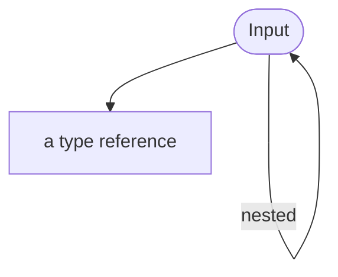

<!-- riddl-prelude
record SignupDetails is { email is String }
type Clicked is Boolean
type CountryCode is String
record AccountData is { email is String }
command Register is { email is String }
command CreateAccount is { details is SignupDetails }
page SignupPage is {
  form Signup accepts record SignupDetails
}
entity Account is {
  state Registered of record AccountData is {
    handler AccountHandler is { on command CreateAccount { ??? } }
  }
}
-->

An Input is the abstract notion of some information provided to an
application by its [user](user.md). To make this more tangible, inputs could
be implemented as any of the following:
* the submission of a typical HTML form a user could fill in,
* the tap of a button on a mobile device,
* the selection of items from a list on a native application, 
* a voice response providing information via any
  [IVR](https://wikipedia.com/en/IVR) system,
* a thought interpreted by a neural link,
* a physical movement interpreted by a motion-detection device,
* a retinal scan,
* picking items from lists of information by looking and blinking
* or any other system by which a human may provide information to a machine

The nature of the implementation for an input is up to the UI Designer.
RIDDL's concept of it is based on the net result: the data type received by
the application. 

An input is a named component of an [application](application.md)
that receives data of a specific [type](type.md) from a
[user](user.md) of the application. Each input can define 
data [types](type.md) and declares a 
[command message](message.md#command) as the data received
by the application's input.

## Syntax

An input is written as an alias, an identifier, an acquisition verb, and the
type it takes in:

<!-- riddl: in-group no-prelude=SignupPage -->
```riddl
form  Signup   accepts record SignupDetails
button Checkout activates type Clicked
picklist Country selects type CountryCode
```

**Aliases**: `input`, `form`, `text`, `button`, `picklist`, `selector`,
`item`, `voice`, `gesture`, `gaze`

**Acquisition verbs**: `acquires`, `reads`, `takes`, `accepts`, `admits`,
`enters`, `provides`, `selects`, `chooses`, `picks`, `initiates`, `submits`,
`triggers`, `activates`, `starts`

The verbs `selects`, `chooses`, `picks`, `enters` and `provides` were added in
RIDDL 2.0; the rest are unchanged.

!!! warning "Selection verbs expect a choice type"
    An input using a **selection** verb — `selects`, `chooses` or `picks` —
    whose type is not a choice among options draws a **StyleWarning**. A
    selection widget should take an
    [Enumeration or Alternation](type.md#compounds); a `String` or an
    `Integer` is almost certainly not what was meant.

    This is never an Error: a predefined type is treated as resolved-but-not-a-
    choice, and a genuinely unresolved reference is skipped so the warning does
    not pile onto the real error.

## Reading an Input

A [handler](handler.md) reads an input's value with the `get from` value
expression:

<!-- riddl: in-app-clauses -->
```riddl
on command Register {
  let details = get from input Signup
  tell command CreateAccount(details) to entity Account
}
```

## Design References

An input may carry a [figma reference](metadata.md#figma-references) linking it
to the frame that depicts it.

## Occurs In
* [Group](group.md)

## Contains



* [Input](input.md) :material-recycle: — nested inputs
* Its data [type](type.md) is **referenced**, not contained

