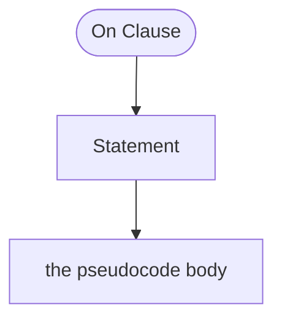

<!-- riddl-prelude
constant MinimumOrder is Natural = 10
record OrderInfo is { id is String, total is Natural }
command PlaceOrder yields event OrderPlaced is { id is String, total is Natural }
event OrderPlaced is { id is String, total is Natural }
command DoIt is { note is String }
-->

# On Clause

An On Clause specifies how to handle a particular kind of message or situation
as part of the definition of a [handler](handler.md). An On Clause is
associated with a specific message definition and contains
[statements](statement.md) that define the handling of that message by the
handler's parent. The containing [Processor](processor.md) is the recipient of
the message and the sender of any statements that send messages.

## Kinds of On Clause

| Clause | Handles |
|--------|---------|
| `on command X` | A specific command message |
| `on event X` | A specific event message |
| `on query X` | A specific query message |
| `on result X` | A specific result message |
| `on init` | Creation and initialization — once, ever |
| `on term` | Termination — once, ever |
| `on activate` | Entity rehydration — every time |
| `on passivate` | Entity eviction — every time |
| `on quiescence <window>` | Nothing arrived for the whole window |
| `on other` | A message not otherwise handled |

`on init` and `on term` bracket the whole life of a definition. `on activate`
and `on passivate` bracket each *residency*: an entity that is evicted from
memory and later rehydrated passivates and activates repeatedly without ever
being initialized or terminated again.

<!-- riddl: in-entity -->
```riddl
handler OrderHandler is {
  on init      { do "load configuration" }
  on activate  { do "warm the pricing cache for this order" }
  on passivate { do "flush the pricing cache" }
  on term      { do "archive the order record" }
}
```

## `on quiescence` — when nothing arrived

Every other clause fires because a message came in. `on quiescence` fires
because **none did**:

<!-- riddl: in-entity -->
```riddl
handler CartHandler is {
  on command ExampleEntityCommand { do "add the item to the cart" }
  on quiescence "PT30M" { do "treat the cart as abandoned" }
}
```

It is **instance-scoped**: the window is measured per processor instance, and
the clock restarts on every message that instance handles. Inside a
[state](state.md)'s handler it is armed only while that state is active, so a
state change disarms it.

### The window

The window is a duration **literal**, or a bare path to a `Duration`-typed
value — a [constant](constant.md), a state field, or a field of the handled
message:

<!-- riddl: in-context -->
```riddl
constant IdleWindow is Duration = "PT10M"

repository Sessions is {
  handler SessionHandler is {
    on quiescence IdleWindow { do "compact the session store" }
  }
}
```

A `let` cannot be named here: a `let` is clause-local and the window is part of
the clause *header*, evaluated before any body runs. The literal is validated
exactly as a [correlation](projector.md#correlations) timeout is, so `"banana"`
and `"0s"` are both Errors, as is a path whose type is not `Duration`
(`handler-quiescence-window-not-duration`).

### Where it is allowed

Any handler-bearing processor may have one — entity, context, adaptor,
projector, repository or streamlet. Two rules bound it:

- **At most one per handler** (`handler-quiescence-duplicate`). A handler that
  wants two different idle behaviours is describing two different windows, and
  the language makes you pick.
- **Never inside a `correlation`** (`handler-quiescence-in-correlation`). A
  correlation already bounds itself with `times out after`, which is the
  projector-specific spelling of the same idea.

!!! note "Unlike `on activate` and `on passivate`, this is an effect block"
    `yield`, `tell`, `send`, `terminate`, `morph` and `initiate` are all legal
    inside `on quiescence`. Timing out is a real business event — a cart is
    abandoned, a session expires — and saying so usually means emitting
    something.

    Event-sourcing rules are unchanged: in an event-sourced entity, change
    state only via a yielded event. That is also what stops replay from
    re-firing the timer.

!!! info "`quiescence` is still a legal identifier"
    It is contextual — recognised only after `on`. Existing models that use it
    as a name keep working.

## Binding the Handled Message

An `on` clause may bind a local name to the message it is handling, using
ordinary type ascription — the same rule as `let x: T = ...` and a field
declaration `p1: String`, read as "`ord` has type `command PlaceOrder`":

<!-- riddl: in-clauses -->
```riddl
on ord: command PlaceOrder {
  when ord.total > MinimumOrder then
    yield event OrderPlaced(id = ord.id, total = ord.total)
  else
    error "an order must reach the minimum"
  end
}
```

Within the body the bound name denotes the **whole message**; a dotted path
reaches its fields. The binding is optional, so every model written without it
parses to exactly the same structure.

!!! warning "Local name validation"
    - A local name that shadows an outer definition is legal but draws a
      **Warning**
    - A binding whose name collides with a field of the message or state is
      legal — bare `foo` is the binding, `foo.foo` is the field — but draws a
      **Warning** about the overload
    - A local name that does not begin with a lowercase letter draws a
      **StyleWarning**, so camelCase like `myCounter` stays legal

## Message Origins

An `on` clause may also name where the message came from, optionally binding a
local name to the origin:

<!-- riddl: skip reason="two spellings of the SAME clause, which cannot share a handler (duplicate content names), and the origin is a sibling context no wrapper can supply" -->
```riddl
on command DoIt from context Other { ??? }
on command DoIt from di: context Other { ??? }
```

An origin may be an [inlet](inlet.md), a [processor](processor.md), a
[user](user.md), or an [epic](epic.md).

## Restrictions by Container

Several restrictions are enforced at **parse** time, so a violating clause
cannot enter the model at all:

| Container | Rule |
|-----------|------|
| [Projector](projector.md) | **Event-only**: `on command`, `on query` and `on record` are rejected. `on event` and `on result` are valid. |
| `on event` (anywhere) | `require` and `error` are forbidden — an event has already happened and must always be accepted. |
| `on activate` / `on passivate` | [Entity](entity.md)-only, and side-effect free: `send`, `tell`, `yield`, `morph` and `become` are rejected. |
| `on quiescence` | At most one per handler, and never inside a `correlation` — which bounds itself with `times out after`. |
| [Adaptor](adaptor.md) | A handler with no `on other` clause is an **Error**. |

!!! warning "Shadowed clauses"
    Within one handler, two `on` clauses handling the same message make the
    later one unreachable. That draws a **StyleWarning** on the later clause.
    Clauses are keyed by their resolved message type where it resolves, so
    distinct spellings of the same message are caught.

## Options

`timeout` (1 argument) and `idempotent` (0 arguments) may be set on an on
clause's metadata.

## Occurs In

* [Handlers](handler.md) — the handler to which the On clause is applied

## Contains



* [Statement](statement.md) — the pseudocode run when the message arrives

