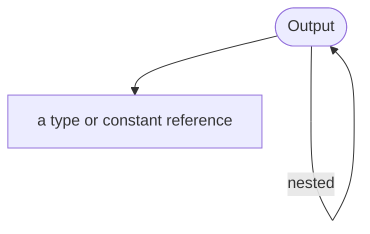

<!-- riddl-prelude
record ReceiptData is { total is Natural }
record CartLine is { sku is String, quantity is Natural }
type ImageRef is URL
-->

An Output definition is concerned with providing information to the
[user](user.md) without regard to the form of that information when
presented to the user. To make this more tangible, an 
Output could be implemented as any of the following:

* the text shown on a web page or mobile application
* the display of an interactive graphic, chart, etc. 
* the presentation of a video or audio recording
* haptic, olfactory or gustatory feedback
* any other way in which a human can receive information from a machine.

The nature of the implementation for an output is up to the UI Designer.
RIDDL's concept of it is based on the net result: the data type received by
the user.

An Output is a named component of an [application](application.md)
that sends data of a specific [type](type.md) from the application to its
[user](user.md). Each output can define data [types](type.md) and declares a
[result message](message.md#result) as the data sent to the 
user.

## Syntax

An output is written as an alias, an identifier, a presentation verb, and what
it presents:

<!-- riddl: in-group -->
```riddl
document Receipt   shows record ReceiptData
list     CartLines displays record CartLine
picture  Avatar    presents type ImageRef
```

**Aliases**: `output`, `document`, `list`, `table`, `graph`, `animation`,
`picture`, `sound`, `speech`, `haptic`

**Presentation verbs**: `presents`, `shows`, `displays`, `writes`, `emits`,
`plays` (sound and animation), `speaks` and `announces` (speech),
`vibrates`, `pulses` and `nudges` (haptics), `diffuses` (scent), and
`serve`, `offer` and `taste`

## Writing to an Output

A [handler](handler.md) publishes a value to an output with the `put`
statement, which is valid in application and context handlers:

<!-- riddl: in-app-clauses -->
```riddl
on query GetReceipt {
  put order.confirmationNumber to output Receipt
}
```

An output that no handler ever writes to draws a **CompletenessWarning** when
a use case claims to show it — see
[Use Case](use-case.md) witnessing.

## Design References

An output may carry a [figma reference](metadata.md#figma-references) linking
it to the frame that depicts it.

## Occurs In
* [Group](group.md)

## Contains



* [Output](output.md) :material-recycle: — nested outputs
* Its data [type](type.md), constant or literal is **referenced**, not contained

