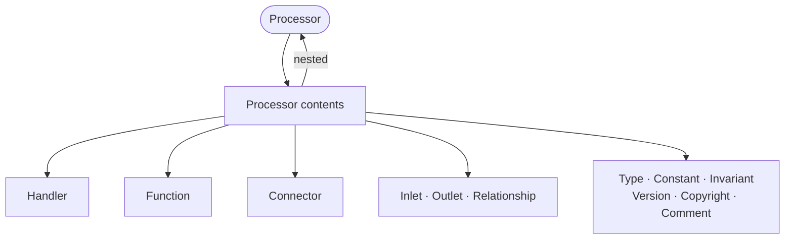

A Processor is an abstract [vital definition](vital.md) with several concrete
manifestations (see below) that represents any definition capable of processing
messages. Processors have [handlers](handler.md) to process messages sent to
them, and can have [inlets](inlet.md) and [outlets](outlet.md) for receiving
and sending messages in streams.

RIDDL 2.0 has **one unified processor model**. Every processor kind is
port-bearing, may carry a streaming shape, and may declare a
[version](version.md) and a [copyright](copyright.md).

## Concrete Processor Types

The following definitions are all processors:

* [Adaptor](adaptor.md) — translates messages between two contexts
* [Context](context.md) — a bounded context
* [Entity](entity.md) — stateful business object (can have multiple handlers per state)
* [Projector](projector.md) — projects events into queryable data
* [Repository](repository.md) — persistent storage abstraction
* [Streamlet](streamlet.md) — the generic `processor`, a stream-processing component

!!! info "Saga and Function are not processors"
    A [Saga](saga.md) and a [Function](function.md) extend the
    [vital definition](vital.md) base rather than Processor, so neither takes a
    [version](version.md) or a [copyright](copyright.md).

    A Saga does, however, bear [inlets](inlet.md) and [outlets](outlet.md) —
    being a coordinator, it has messages to receive and emit. A Function does
    not.

## The `processor` Keyword

The generic streaming processor is declared with the `processor` keyword and an
optional shape ascription:

<!-- riddl: skip reason="illustrative fragment; references vocabulary this page does not define" -->
```riddl
processor OrderEnricher as flow is {
  inlet RawOrders is type OrderEvent
  outlet EnrichedOrders is type EnrichedOrderEvent

  handler Enrich is {
    on event OrderEvent {
      do "Look up customer details and product information"
      send event EnrichedOrderEvent to outlet EnrichedOrders
    }
  }
}
```

The `as <shape>` ascription is also available on every other processor header —
`context`, `entity`, `adaptor`, `projector` and `repository`.

## Message Delivery

Messages can be delivered to a processor in two ways:

1. **To an inlet** — for stream-based message flow, routed by a
   [connector](connector.md)
2. **Directly to the handler** — via the `tell` statement for point-to-point
   messaging

## Ports

An [inlet](inlet.md) provides the name and data type for an input to the
processor. An [outlet](outlet.md) provides the name and data type for an
output. There can be several of each, or none.

Ports may be declared in **any** processor body, not only in streamlets. An
entity may own an outlet through which it publishes its events; a projector may
own an inlet.

## Shape

A processor's **shape** describes its streaming arity. It is normally *derived*
from the ports the processor declares, and may optionally be *ascribed* to
state the intent explicitly.

| Shape | Inlets | Outlets | Description | Synonym |
|-------|--------|---------|-------------|---------|
| `source` | 0 | 1+ | Originates data and publishes it to outlets | |
| `sink` | 1+ | 0 | Terminates data flow by consuming from inlets | |
| `flow` | 1 | 1 | Transforms data from one inlet to one outlet | `cascade` |
| `merge` | 2+ | 1 | Combines data from several inlets into one outlet | `fanin` |
| `split` | 1 | 2+ | Routes data from one inlet to several outlets | `broadcast`, `fanout` |
| `router` | 1 | 2+ | Routes messages based on content | |
| `void` | 0 | 0 | Declares no ports at all | |

Fan-in and fan-out are modeled by declaring **multiple ports**, never by
attaching several connectors to one port. See
[Connector](connector.md#port-cardinality).

!!! warning "Shape validation"
    - An ascribed shape that contradicts the declared arity is an **Error**,
      naming the ascription, the arity and the derived shape.
    - A processor with at least one port and no ascription draws a
      suppressible **StyleWarning**.
    - A portless, unascribed processor draws nothing from this check.

## Handlers

A processor contains handlers that specify how the business logic should
proceed. For sources, sinks and flows this is straightforward. For splits,
merges and routers, the handler specifies how messages received on inlets are
transformed and routed to outlets.

## Options

The `protocol` option (one argument) is valid on any processor, and is consumed
by AsyncAPI generation.

## Occurs In

* [Contexts](context.md)
* Any other processor body

## Contains



* Everything in the shared processor bundle: [Type](type.md), [Constant](constant.md), [Invariant](invariant.md), [Function](function.md), [Handler](handler.md), [Streamlet](streamlet.md), nested [Processor](processor.md), [Connector](connector.md), Relationship, [Inlet](inlet.md), [Outlet](outlet.md), [Version](version.md), [Copyright](copyright.md), [Comment](comment.md)
* [Include](include.md)

