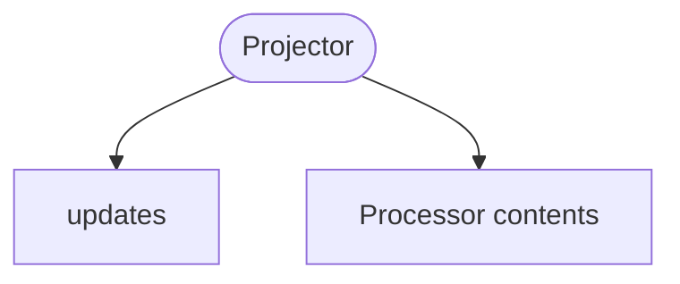

<!-- riddl-domain-prelude
context OrderContext is {
  event OrderCompleted is { orderId is String, amount is Natural }
  event OrderRefunded is { orderId is String, amount is Natural }
}
-->

Projectors get their name from
[Euclidean Geometry](https://en.wikipedia.org/wiki/Projection_(mathematics))
but are probably more analogous to a
[relational database view](https://en.wikipedia.org/wiki/View_(SQL)). The
concept is very simple in RIDDL: projectors gather data from entities and
other sources, transform that data into a specific record type, and support
querying that data arbitrarily.

Projectors transform update events from entities into a data set that can
be more easily queried. A projector's data is always a duplicate and not the
system of record for the data. Typically persistent entities are the system of
record.

## Projectors Are Event-Only

As of RIDDL 2.0, a projector [handler](handler.md) may contain `on event` and
`on result` clauses only. `on command`, `on query` and `on record` are
rejected at **parse** time.

This makes the CQRS split structural rather than conventional. A projector's
one job is to fold events into a read model; it does not accept commands, and
it does not answer queries. Queries are served by the
[repository](repository.md) the projector `updates`.

<!-- riddl: in-domain -->
```riddl
context Sales is {
  record SalesTotals is { day is String, amount is Natural }

  repository SalesData is {
    schema Totals is relational of totals as type SalesTotals
  }

  projector SalesDashboard is {
    record DailySales is { day is String, total is Natural }

    updates repository SalesData

    handler SalesEvents is {
      on event OrderContext.OrderCompleted {
        do "Update daily sales totals with the order amount"
      }
      on event OrderContext.OrderRefunded {
        do "Subtract the refund amount from daily totals"
      }
    }
  }
}
```

!!! warning "A projector must define a record"
    `Projector 'X' lacks a required Record definition` is an **Error**. The
    record is the projection's shape — what the folded events produce — so a
    projector without one has nothing to project into.

!!! warning "Validation"
    **Completeness Warnings:**

    - A projector referencing no repository
    - A projector handler that never `tell`s to a repository
    - A declared repository reference never used in a `tell`

## Options

`cacheable` (0–1 arguments), `batch` (1 argument), `microservice` and
`protocol` are available on a projector.

## Occurs In
* [Contexts](context.md)
* [Modules](module.md)

## Contains



* `updates` — the [repository](repository.md) this projector maintains
* Everything a [processor](processor.md) may contain: [Type](type.md), [Constant](constant.md), [Invariant](invariant.md), [Function](function.md), [Handler](handler.md), [Streamlet](streamlet.md), nested [Processor](processor.md), [Connector](connector.md), Relationship, [Inlet](inlet.md), [Outlet](outlet.md), [Version](version.md), [Copyright](copyright.md), [Comment](comment.md)
* [Include](include.md)

