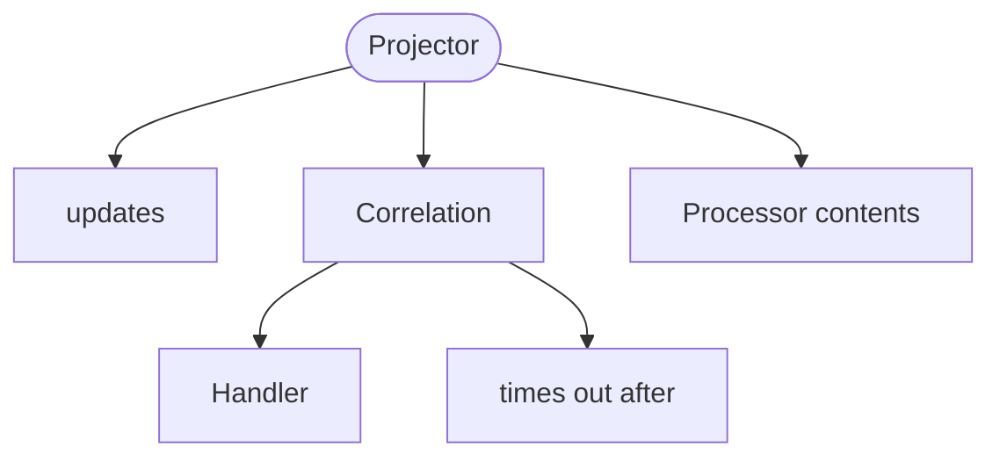

<!-- riddl-domain-prelude
context OrderContext is {
  event OrderCompleted is { orderId is String, amount is Natural }
  event OrderRefunded is { orderId is String, amount is Natural }
}
-->

Projectors get their name from
[Euclidean Geometry](https://en.wikipedia.org/wiki/Projection_(mathematics))
but are probably more analogous to a
[relational database view](https://en.wikipedia.org/wiki/View_(SQL)). The
concept is very simple in RIDDL: projectors gather data from entities and
other sources, transform that data into a specific record type, and support
querying that data arbitrarily.

Projectors transform update events from entities into a data set that can
be more easily queried. A projector's data is always a duplicate and not the
system of record for the data. Typically persistent entities are the system of
record.

## Projectors Are Event-Only

As of RIDDL 2.0, a projector [handler](handler.md) may contain `on event` and
`on result` clauses only. `on command`, `on query` and `on record` are
rejected at **parse** time.

This makes the CQRS split structural rather than conventional. A projector's
one job is to fold events into a read model; it does not accept commands, and
it does not answer queries. Queries are served by the
[repository](repository.md) the projector `updates`.

<!-- riddl: in-domain -->
```riddl
context Sales is {
  record SalesTotals is { day is String, amount is Natural }

  repository SalesData is {
    schema Totals is relational of totals as record SalesTotals
  }

  projector SalesDashboard is {
    record DailySales is { day is String, total is Natural }

    updates repository SalesData

    handler SalesEvents is {
      on event OrderContext.OrderCompleted {
        do "Update daily sales totals with the order amount"
      }
      on event OrderContext.OrderRefunded {
        do "Subtract the refund amount from daily totals"
      }
    }
  }
}
```

!!! warning "A projector must define a record"
    `Projector 'X' lacks a required Record definition` is an **Error**. The
    record is the projection's shape — what the folded events produce — so a
    projector without one has nothing to project into.

!!! warning "Validation"
    **Completeness Warnings:**

    - A projector referencing no repository
    - A projector handler that never `tell`s to a repository
    - A declared repository reference never used in a `tell`

## Correlations

A projection often has to **join facts that arrive separately** — an order
placed here, a payment taken there, a shipment somewhere else. A correlation is
where the projector holds that partial join while it waits.

<!-- riddl: in-domain -->
```riddl
context Fulfillment is {
  event OrderPlaced  is { orderId is String, customerId is String, total is Natural }
  event PaymentTaken is { orderId is String, customerId is String, amount is Natural }

  command RecordFulfillment is {
    customerId is String, orderId is String,
    total is Natural, paidAmount is Natural
  }
  command ReportStalled is { orderId is String }

  record FulfillmentRow is { orderId is String, total is Natural }

  repository Fulfillments is {
    schema Rows is relational of rows as record FulfillmentRow
    handler Store is {
      on command RecordFulfillment { do "write the joined row" }
      on other { error "Unrecognized message" }
    }
  }

  entity Monitor is {
    state Watching of record FulfillmentRow is {
      handler MonitorHandler is { on command ReportStalled { ??? } }
    }
  }

  projector Joiner is {
    record Joined is { orderId is String }
    updates repository Fulfillments

    correlation FulfillmentJoin by customerId, orderId
      yields command RecordFulfillment is {
      handler Collect is {
        on event OrderPlaced  { set field RecordFulfillment.total to "the order total" }
        on event PaymentTaken { set field RecordFulfillment.paidAmount to "the amount paid" }
      }
    } times out after "30 days" {
      tell command ReportStalled(orderId = "the stalled order") to entity Monitor
    }
  }
}
```

Read the declaration as: *accumulate events keyed by `customerId, orderId`;
when the accumulation is complete, emit `RecordFulfillment` to the repository;
if 30 days pass first, do this instead.*

### What completes a correlation

**Completion is derived from the target's type, never written down.** The
correlation completes when every **required** field of the yielded command has
been set by some fold. There is no completion condition to state, so there is
nothing to keep in sync when the command changes.

Two Errors follow from that, and they are the reason the feature is worth
having — each turns a production mystery into a compile-time fact:

!!! warning "A correlation that can never complete is an Error"
    *"Correlation 'X' can never complete: Command 'C' requires 'f', which no
    fold sets."*

    **Key fields are exempt** — they are filled from the correlation key
    itself. Optional and zero-or-more fields are not required, since both admit
    absence.

!!! warning "Two folds writing one field is an Error"
    *"Field 'f' of command C is set by more than one clause of Correlation
    'X'."*

    The completed value would depend on which event arrived first, and across
    sources that order is not guaranteed. The model would produce different
    results from identical events, so it is rejected rather than left racy.

### The timeout is mandatory

`times out after "<duration>" { … }` is **grammar, not an option**, and it
cannot be omitted. Options are advisory — "honored if possible" — and a bound
that must fire a block of statements is not advisory. The practical
consequence: a correlation with no bound cannot be written, so unbounded
retention is not a state any implementation has to handle.

The clock starts at the **first handled event** for a key tuple. A timeout
**does not poison the key**: nothing was written, so a later event bearing that
tuple starts a fresh correlation. That can produce a repeating notification for
a correlation that never completes, which is deliberate — something is wrong
and stays wrong.

### Consequences worth knowing before you model one

| | |
|---|---|
| **Identity** | the **full** key tuple, ordered as written. A tuple sharing only some components with a completed one is a different correlation, and the order is never canonicalized. |
| **Target kind** | a **command**, not a record. A projector's only output is a change to a repository, and a repository is changed by handling a command — a handler clause takes a message, and a record is not one. |
| **Scaling** | a projector declaring correlations may **not** be scaled round-robin. Every event carrying a key tuple must reach the instance holding that tuple's partial, so distribution must be **by key**. |
| **Own state** | a correlating projector is no longer stateless: its state is the checkpoint *plus* the in-flight partials. |
| **Replay** | folds are pure, so re-running them has no effect beyond rebuilding the partial. The timeout block is an **effect**, fired **at-least-once** on every timeout including during reprocessing — so write timeout bodies to be idempotent and expect duplicates during a backfill. |

Durability of the in-flight partials is deliberately **not** specified. The
declared window is the honest statement of what is needed: a 30-day window
obliges an implementation that survives 30 days; a 5-second window does not.

## Options

`cacheable` (0–1 arguments), `batch` (1 argument), `microservice` and
`protocol` are available on a projector.

## Occurs In
* [Contexts](context.md)
* [Modules](module.md)

## Contains



* `updates` — the [repository](repository.md) this projector maintains
* `correlation` — a keyed accumulation of several events into one command (see above)
* Everything a [processor](processor.md) may contain: [Type](type.md), [Constant](constant.md), [Invariant](invariant.md), [Function](function.md), [Handler](handler.md), [Streamlet](streamlet.md), nested [Processor](processor.md), [Connector](connector.md), Relationship, [Inlet](inlet.md), [Outlet](outlet.md), [Version](version.md), [Copyright](copyright.md), [Comment](comment.md)
* [Include](include.md)

