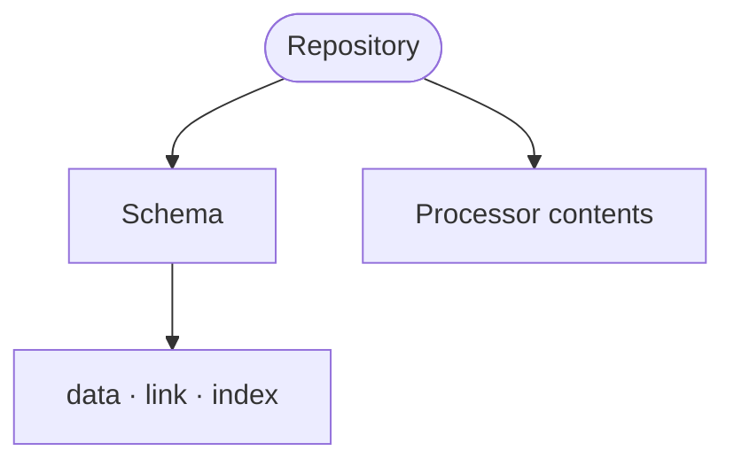

A RIDDL repository is an abstraction for anything that can retain 
information (e.g. [messages](message.md)) for retrieval at a
later time. This might be a relational database, NoSQL database, a data lake, 
an API, or something not yet invented. There is no specific technology implied
other than the retention and retrieval of information. Thinking of repositories
only as a database is missing the mark. 

## Schemas
As part of their intrinsic definition, repositories have schemas. Schemas in 
implementation and leaves them unspecified. Repository schemas in RIDDL have
little relationship to SQL because they are not relational databases and indeed
must support the schema for any kind of data storage. The schema is specified
more like a graph database.  A set of types defines what can be placed in 
the database, an optional set of links defines how the fields of those types
are related, and a set of indices defines which fields the database indexes. 

A repository may define multiple schemas, each with its own _kind_. The kind of
schema may be: flat, relational, time-series, graphical, hierarchical, star, 
document, columnar, vector, or other. These are only suggestive of the kind of
storage layout the repository uses. 

<!-- riddl: skip reason="illustrative fragment; references vocabulary this page does not define" -->
```riddl
repository CartRepository is {
  schema CartData is relational
    of cart as type Cart
    link cartItems as field Cart.items.id to field Product.id
    index on field Cart.id
}
```

!!! warning "`as type T` is strict — changed in RIDDL 2.0"
    The clause says `as type`, so `T` must genuinely **be** a
    [Type](type.md). A path that lands on an Entity, or on anything else,
    is an **Error** even though it parses.

    This check previously never ran. Turning it on produced 202 errors across
    186 of the 187 models in `riddl-models` — nearly the whole corpus — every
    one of them a clause that had been relying on a check that did nothing. If
    a schema of yours suddenly errors here, that is why.

    The fix is usually to point at the `record` that describes the stored
    shape, rather than at the entity that owns it.

## Handling Messages
A repository has a [handler](handler.md) that processes 
messages with respect to the repository's stored information.

[Query messages](message.md#query) sent to the repository 
are requests for retrieval of some information. The handler should define 
how the processing of that query should proceed and yield a 
[Result message](message.md#result).

[Command messages](message.md#command) sent to the
repository are updates to the repository. The handler should define how the
update works and may optionally yield an
[Event message](message.md#event) but generally that is
handled at a higher level of abstraction. 

## Repositories at Domain Scope

A repository normally lives in a [Context](context.md). But a repository that
**synthesizes** messages from entities across several contexts, and is queried
by several contexts, belongs to the [Domain](domain.md) instead — putting it
inside any one context would misrepresent who owns it.

```riddl
domain Commerce is {
  repository SalesData is { ??? }   // reaches Orders, Catalog and Shipping

  context Orders   is { ??? }
  context Catalog  is { ??? }
  context Shipping is { ??? }
}
```

!!! warning "Scope validation"
    A repository's **reach** is the set of contexts owning the messages its
    `on` clauses handle.

    - **Error** — a domain-scoped repository reaching only ONE context. It is
      provably unnecessary at domain scope; move it into that context. Zero
      resolvable contexts means an incomplete model rather than proof, so that
      draws nothing.
    - **CompletenessWarning** — a context-scoped repository reaching another
      context. Consider promoting it to domain scope.

## Options

`transient` marks a repository whose contents are not durably persisted — a
cache-like store. `batch` (1 argument), `microservice` and `protocol` are also
available.

## Occurs In
* [Context](context.md)
* [Domain](domain.md) — when it synthesizes across several contexts
* [Module](module.md)

## Contains



* `schema` — its kind, data, links and indices
* Everything a [processor](processor.md) may contain: [Type](type.md), [Constant](constant.md), [Invariant](invariant.md), [Function](function.md), [Handler](handler.md), [Streamlet](streamlet.md), nested [Processor](processor.md), [Connector](connector.md), Relationship, [Inlet](inlet.md), [Outlet](outlet.md), [Version](version.md), [Copyright](copyright.md), [Comment](comment.md)
* [Include](include.md)

