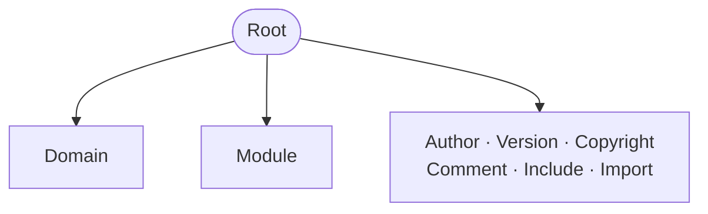

The *root* concept refers to the container of domains. Domains are the top 
level definition in RIDDL but because RIDDL is hierarchical, and you can have
more than one domain definition at the top level, something has to contain those
top level domains. We call that the *root*. A root is not a definition since it
has no name. You can think of a *root* as the file in which a domain is defined.

## Root vs. Module

A Root is deliberately **narrow**: it holds only the handful of things that
make sense at the outermost scope of a file. A [Module](module.md) is the wide,
*flat* container that will hold any top-level definition in any order, and it
is the unit of reuse and of compiled output.

!!! warning "Nebula is deprecated"
    RIDDL 1.x had a third top-level container: an anonymous flat bag called a
    *nebula*, used as a scratch pad. A Module is the same idea with a name, so
    it absorbed the nebula in 2.0.

    An anonymous whole-file sequence of definitions still parses, but emits one
    `[deprecated]` message and yields a Module with the synthetic id `nebula`.

## Occurs In
At the file root of the first file `riddlc` reads. 

## Contains

* [Domain](domain.md) and [Module](module.md) — the two containers a model starts from
* [Author](author.md), [Version](version.md), [Copyright](copyright.md), [Comment](comment.md)
* [Include](include.md) and `import` directives

