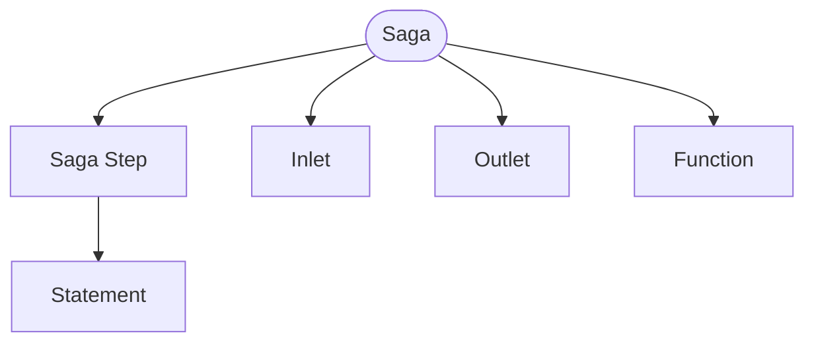

A Saga is a distributed persistent transaction that uses the
[Saga Pattern](https://microservices.io/patterns/data/saga.html). Sagas are 
used to coordinate state changes across multiple components (typically 
entities) in a system. Every change (action) has a *compensating action* to 
undo the action. This permits an organized rollback if one component cannot 
proceed with the transaction.

## Signature

A saga's `requires` and `returns` may name an existing [type](type.md), the
same as a [function](function.md)'s:

<!-- riddl-prelude
record CheckoutInputs is { orderId is String }
record CheckoutOutcome is { confirmed is Boolean }
command ProcessPayment is { orderId is String }
command RefundPayment is { orderId is String }
command ReserveItems is { orderId is String }
command ReleaseItems is { orderId is String }
entity PaymentService is { ??? }
entity Inventory is { ??? }
-->
<!-- riddl: in-context -->
```riddl
saga CheckoutProcess is {
  requires record CheckoutInputs
  returns  record CheckoutOutcome

  step TakePayment is {
    tell command ProcessPayment(orderId) to entity PaymentService
  } reverted by {
    tell command RefundPayment(orderId) to entity PaymentService
  }

  step ReserveStock is {
    tell command ReserveItems(orderId) to entity Inventory
  } reverted by {
    tell command ReleaseItems(orderId) to entity Inventory
  }
} with {
  option is compensate
}
```

A saga must define **at least two** steps — a one-step saga has nothing to
coordinate — and a step's name must not collide with the message it sends,
or the reference becomes ambiguous.

## Options

| Option | Meaning |
|--------|---------|
| `compensate` | On failure, run the accumulated steps' undo blocks in reverse |
| `parallel` | Start all steps at once; the coordinator gathers results asynchronously. Any one failure compensates in reverse order of the original sends. |
| `timeout("30s")` | How long the whole saga may take |
| `retry(3)` | How many times to retry a step that fails |
| `undo-retry(2)` | How many times to retry a compensation that fails |
| `failure-message` | The message to emit when the saga ultimately fails |

A saga is **sequential by definition**, so `parallel` declares the exception
and there is no `sequential` option — asking for the default said nothing, so
it was dropped in RIDDL 2.0.

`retry` appears at two scopes and means the same thing at each: on a
[SagaStep](sagastep.md) it bounds that step, on the saga it bounds every step.
A step's own `retry` wins for that step; the saga's applies to steps without
one. That precedence is a contract between generators, not something `riddlc`
enforces.

!!! warning "Durations must be positive"
    `timeout("0s")`, `timeout("-1m")` and `timeout("PT0S")` are **Errors**. A
    saga bounded by zero has expired before its first step starts, and a
    negative bound is not describable at all. It is a distinct message from the
    vague-duration warning, because the two need different fixes: one means
    "state a unit", the other means "state a magnitude".

These options are contracts for the code generator rather than behavior
`riddlc` enforces — apart from the duration rule above, which it checks.

## Scope

!!! warning "A saga stays within one domain"
    A saga orchestrates a multi-step transaction within **one bounded
    domain**. Every reference in a step — send/tell/yield message targets,
    `morph` entity and state, `become` entity and handler, `put` output, and
    any embedded `call` or `get` — must resolve to a definition within the
    saga's own enclosing [domain](domain.md).

    A reference resolving to a definition owned by a *different* domain
    crosses the saga's boundary and is an **Error**. A referent with no owning
    domain — a root or shared definition — is allowed.

!!! warning "A saga needs at least two steps"
    One step is an **Error**: *"Sagas must define at least 2 steps"*. A
    single-step transaction has nothing to coordinate and no ordering to
    compensate in reverse, so it wants a plain handler instead.

!!! warning "One failure point per step"
    A step's do/undo is all-or-nothing: the compensation assumes all or none
    of the do-block happened. So a step should have **at most one** potential
    failure point, and more than one draws a **Warning** suggesting the step
    be split.

    `send`, `tell`, `yield` and `put` can fail, and so can each embedded
    `call` or `get` — `let x = call F(get from input I)` counts as two.

!!! warning "A saga step may not `ask`"
    An [`ask`](../references/language-reference.md#ask) anywhere in a step is
    an **Error**, including one nested inside a larger value expression. A saga
    must not depend on dynamic state, or the same inputs could yield different
    transaction results at different times — and compensation would then be
    reversing something other than what actually happened.

    Acquire the value in a handler and pass it into the saga through its
    `requires`, so the saga is closed over its inputs and the undo sees the
    same data the do saw.

    A step containing an `ask` is not also reported for the failure-point rule
    above: an `ask` is itself a failure point, so every such step would trip
    that rule too, and the advice to split the step would not help.

## A Saga Is Not a Processor

A Saga extends the [vital definition](vital.md) base rather than
[Processor](processor.md), so it takes no [version](version.md) and no
[copyright](copyright.md).

It **does** bear [inlets](inlet.md) and [outlets](outlet.md) — a coordinator
has messages to receive and emit — so "not a processor" is about the version and
copyright scopes, not about ports. Its contents are exactly: steps, ports,
functions and includes.

## Occurs In
* [Contexts](context.md)
* [Domains](domain.md)
* [Modules](module.md)

## Contains



* [Saga Step](sagastep.md) — the forward action and its compensation
* [Inlet](inlet.md) and [Outlet](outlet.md) — a saga bears stream ports even though it is not a [processor](processor.md)
* [Function](function.md)
* [Include](include.md)

