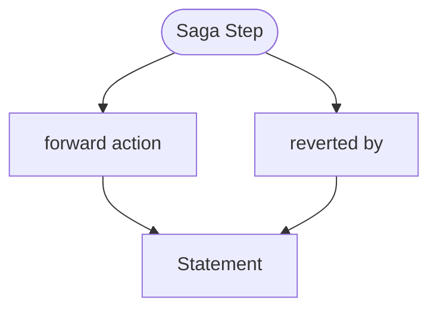

<!-- riddl-prelude
record PaymentInputs is { orderId is String, customerId is String,
  amount is Natural, transactionId is String }
record PaymentOutcome is { note is String }
record InventoryData is { orderId is String }
command ReserveItems is { orderId is String }
command ReleaseReservation is { orderId is String }
command ProcessCharge is { customerId is String, amount is Natural }
command RefundCharge is { transactionId is String }
command CreateOrder is { customerId is String }
command CancelOrder is { orderId is String }
entity Inventory is {
  state Held of record InventoryData is {
    handler InventoryHandler is {
      on command ReserveItems { ??? }
      on command ReleaseReservation { ??? }
    }
  }
}
entity PaymentService is {
  state Charging of record InventoryData is {
    handler PaymentHandler is {
      on command ProcessCharge { ??? }
      on command RefundCharge { ??? }
    }
  }
}
entity OrderService is {
  state Placing of record InventoryData is {
    handler OrderHandler is {
      on command CreateOrder { ??? }
      on command CancelOrder { ??? }
    }
  }
}
-->

A saga step represents one action in a [Saga](saga.md)—a distributed
transaction that coordinates changes across multiple components. Each step
defines both a forward action and a compensating action, so a later failure
can be rolled back.

## Purpose

Saga steps provide:

- **Atomic operations**: Each step succeeds or fails as a unit
- **Compensation logic**: Define how to reverse an action if needed
- **Clear sequencing**: Steps execute in defined order
- **Distributed coordination**: Manage state across multiple entities

## Syntax

A step is an identifier, a forward block, and a `reverted by` compensation
block. Inputs and outputs are declared once for the whole saga, not per step:

<!-- riddl: in-context -->
```riddl
saga ProcessPayment is {
  requires record PaymentInputs
  returns  record PaymentOutcome

  step ReserveInventory is {
    tell command ReserveItems(PaymentInputs.orderId) to entity Inventory
  } reverted by {
    tell command ReleaseReservation(PaymentInputs.orderId) to entity Inventory
  } with {
    briefly as "Holds stock while payment is attempted"
  }

  step ChargePayment is {
    tell command ProcessCharge(PaymentInputs.customerId, PaymentInputs.amount) to entity PaymentService
  } reverted by {
    tell command RefundCharge(PaymentInputs.transactionId) to entity PaymentService
  }

  step PlaceOrder is {
    tell command CreateOrder(PaymentInputs.customerId) to entity OrderService
  } reverted by {
    tell command CancelOrder(PaymentInputs.orderId) to entity OrderService
  }
} with {
  option is compensate
}
```

The `by` in `reverted by` is optional, as readability words generally are.

## Step Components

| Component | Required | Description |
|-----------|----------|-------------|
| identifier | Yes | The step's name |
| forward block | Yes | The action to perform |
| `reverted by` block | Yes | The compensation that reverses it |
| `with { }` | No | Metadata, including step options |

## Execution Flow

When a saga executes:

1. Steps run in sequence, each forward action executing in order
2. If a step fails, the saga reverses direction
3. Each completed step's compensation runs in reverse order
4. The saga completes when all compensations finish

```
Normal flow:     Step1 → Step2 → Step3 → Success
Failure at S3:   Step1 → Step2 → Step3 (fails)
                        ↓
Compensation:    Step2.reverted → Step1.reverted → clean state
```

Add `option is compensate` on the [saga](saga.md) to declare that this
rollback happens automatically. With `option is parallel`, all steps start at
once and any one failure compensates in reverse order of the original sends.

## One Failure Point Per Step

!!! warning "Validation"
    A step's forward and compensating blocks are **all-or-nothing**: the
    compensation assumes all or none of the forward block happened. A step
    should therefore have **at most one** potential failure point, and more
    than one draws a **Warning** suggesting the step be split.

    `send`, `tell`, `yield` and `put` can fail, and so can each embedded
    `call` or `get` — `let x = call F(get from input I)` counts as two. The
    count walks nested `when`, `match` and `foreach` bodies too.

    This is the concrete form of the "keep steps small" advice below: a step
    that can fail in two places cannot be cleanly compensated.

!!! warning "Steps stay within one domain"
    Every reference in a step must resolve to a definition within the saga's
    own enclosing [domain](domain.md). A reference owned by a different domain
    is an **Error**.

## Options

`timeout` (1 argument), `retry` (1–2 arguments) and `delay` (1 argument) may
be set in a step's `with { }` block.

## Statements Available

A saga step's blocks admit `send`, `tell`, `yield`, `put`, `do` and `error`.

## Best Practices

1. **Make steps idempotent**: Steps should be safe to retry
2. **Keep steps small**: One failure point per step, which the validator
   checks
3. **Design compensations carefully**: Ensure the reversal truly reverses
4. **Handle partial failures**: Some actions can't be fully undone (a sent
   email, for instance) — design accordingly
5. **Log everything**: Saga debugging requires visibility into each step

## Occurs In

* [Sagas](saga.md)

## Contains



* [Statements](statement.md) in **both** blocks: the forward action and the `reverted by` compensation

