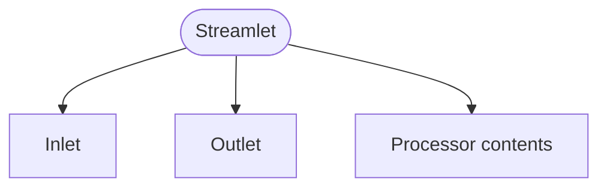

<!-- riddl-domain-prelude
event RawOrder is { id is Natural }
event EnrichedOrder is { id is Natural }
-->
<!-- riddl-prelude
constant AlertThreshold is Natural = "100"
event TemperatureReading is { value is Natural }
event TemperatureAlert is { value is Natural }
event TemperatureMetric is { value is Natural }
event OrderEvent is { id is Natural }
event UserNotification is { note is String }
event RawOrder is { id is Natural }
event EnrichedOrder is { id is Natural }
-->

A Streamlet is a [processor](processor.md) that handles streaming data flows.
Streamlets are the building blocks for data pipelines, connecting sources of
data to consumers through transformations.

In RIDDL 2.0 a streamlet is declared with the generic `processor` keyword and
an optional shape ascription. The shape is otherwise **derived** from how many
[inlets](inlet.md) and [outlets](outlet.md) the processor declares.

<!-- riddl: in-context -->
```riddl
processor TemperatureProcessor as split is {
  inlet readings is type TemperatureReading
  outlet alerts is type TemperatureAlert
  outlet metrics is type TemperatureMetric

  handler ProcessReading is {
    on reading: event TemperatureReading {
      when reading.value > AlertThreshold then
        send event TemperatureAlert(reading.value) to outlet alerts
      end
      send event TemperatureMetric(reading.value) to outlet metrics
    }
  }
}
```

## Shapes

| Shape | Inlets | Outlets | Description | Synonym |
|-------|--------|---------|-------------|---------|
| `source` | 0 | 1+ | Generates data (external systems, timers) | |
| `sink` | 1+ | 0 | Consumes data (database writes, notifications) | |
| `flow` | 1 | 1 | Transforms data from input to output | `cascade` |
| `merge` | 2+ | 1 | Combines data from several inputs into one | `fanin` |
| `split` | 1 | 2+ | Routes data from one input to several outputs | `broadcast`, `fanout` |
| `router` | 1 | 2+ | Routes data based on content or rules | |
| `void` | 0 | 0 | No ports (placeholder or utility) | |

!!! warning "The dedicated shape keywords are deprecated"
    `source`, `sink`, `flow`, `merge`, `split` and `router` still parse as
    standalone keywords, but each emits a `[deprecated]` message telling you to
    write `processor <id> as <keyword>` instead. They are slated for removal in
    3.0. Prettified output normalizes them, so running `riddlc prettify` over a
    1.x model migrates them for you.

## Sources

Sources generate data without receiving input. They might poll external
systems, listen for external events, generate data on timers, or read from
files and databases.

<!-- riddl: in-context -->
```riddl
processor OrderEventSource as source is {
  outlet orders is type OrderEvent

  handler GenerateEvents is {
    on init {
      do "Subscribe to order queue and emit events"
    }
  }
}
```

## Sinks

Sinks consume data without producing output. They might write to databases,
send notifications, update external systems, or log and archive data.

<!-- riddl: in-context -->
```riddl
processor NotificationSink as sink is {
  inlet notifications is type UserNotification

  handler SendNotifications is {
    on event UserNotification {
      do "Send notification via email or push"
    }
  }
}
```

## Flows

Flows transform data from one shape to another:

<!-- riddl: in-context -->
```riddl
processor OrderEnricher as flow is {
  inlet rawOrders is type RawOrder
  outlet enrichedOrders is type EnrichedOrder

  handler EnrichOrder is {
    on raw: event RawOrder {
      do "Look up customer details and product info"
      send event EnrichedOrder(raw.id) to outlet enrichedOrders
    }
  }
}
```

## Connecting Processors

Processors are wired together with [Connectors](connector.md), which link an
outlet to an inlet:

<!-- riddl: in-domain -->
```riddl
context DataPipeline is {
  processor Ingest    as source is { outlet events is type RawOrder }
  processor Transform as flow   is {
    inlet input is type RawOrder
    outlet output is type EnrichedOrder
  }
  processor Store     as sink   is { inlet data is type EnrichedOrder }

  connector IngestToTransform is
    from outlet Ingest.events to inlet Transform.input
  connector TransformToStore is
    from outlet Transform.output to inlet Store.data
}
```

Exactly one connector may attach to any given port. To fan out, declare more
outlets rather than more connectors. To discard output you genuinely do not
need, route it to the [standard module's](standard-module.md) `BottomlessPit`.

## Use Cases

- **Event Processing**: React to events in real time
- **Data Integration**: Move data between systems
- **ETL Pipelines**: Extract, transform and load data
- **Monitoring**: Collect and process metrics
- **Notifications**: Route alerts to appropriate channels

## Streamlets vs. Entities

| Use Case | Streamlet | Entity |
|----------|-----------|--------|
| **Stateless transformation** | Yes | No |
| **Long-lived business state** | No | Yes |
| **High-throughput data flow** | Yes | Maybe |
| **Complex business rules with state** | No | Yes |
| **Data enrichment/filtering** | Yes | No |
| **Order processing with lifecycle** | No | Yes |

**Rule of thumb**: If you need to remember something between messages, use an
Entity. If you're transforming or routing messages without persistent state,
use a streaming processor.

This is a question of *purpose*, not of capability: an entity may declare ports
too, and often does — that is how it publishes its events into a stream.

## Occurs In

* [Contexts](context.md)
* Any other processor body

## Contains



* [Inlet](inlet.md) and [Outlet](outlet.md) — its stream ports, in the number its shape requires
* Everything a [processor](processor.md) may contain: [Type](type.md), [Constant](constant.md), [Invariant](invariant.md), [Function](function.md), [Handler](handler.md), [Streamlet](streamlet.md), nested [Processor](processor.md), [Connector](connector.md), Relationship, [Inlet](inlet.md), [Outlet](outlet.md), [Version](version.md), [Copyright](copyright.md), [Comment](comment.md)
* [Include](include.md)

