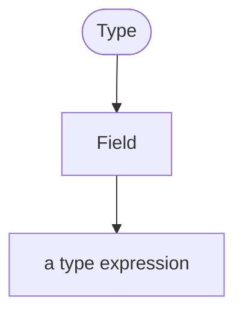

## Introduction
The RIDDL language allows users to define types of data, or information. RIDDL's
type system is fairly rich, for a specification language, providing 
abstractions for many concretely common information structures. This is done to
make it easier for domain engineers and experts to understand the models they
are creating. 

A *type* defines the shape of some information. There are many kinds of type
definitions allowed, so we have grouped them into categories:

[TOC]

## Predefined Types {#predefined}
RIDDL supports several predefined types that just "exist" because they are:
* applicable to nearly all fields of study or knowledge domains
* fundamental in nature, covering the [SI base units](https://en.wikipedia.org/wiki/SI_base_unit)
* fundamental in business, covering basic financial quantities such as currency
* easily represented in any computing environment

RIDDL inherently knows about these predefined types so to use them you just 
use their name, no further definition is required. Here are the 
simple predefined types:

### Simple Predefined Types {#simple}

| Name        | Description                                                       |
|-------------|-------------------------------------------------------------------|
| Anything    | An unspecified, arbitrary type, compatible with any other type    |
| Nothing     | A type that cannot hold any value, commonly used as a placeholder |
| Boolean     | A Boolean value, with values true or false                        |
| Current     | An SI unit of electric current, measured in Amperes               |
| Date        | A date value comprising a day, month and year                     |
| DateTime    | A combination of Date and Time                                    |
| Duration    | An amount of time, measured in SI units of seconds                |
| Length      | An SI unit of distance measured in meters                         |
| Luminosity  | An SI unit of luminous intensity, measured in candelas            |
| Mass        | An SI unit of mass measured in kilograms                          |
| Mole        | An SI unit of an amount of substance, measured in mol             |
| Number      | An arbitrary number, integer, decimal or floating point           |
| String      | A sequence of Unicode characters                                  |
| Temperature | An SI unit of thermodynamic temperature, measured in Kelvin       |
| Time        | A time value comprising an hour, minute, second and millisecond   |
| TimeStamp   | A fixed point in time                                             |
| UUID        | A randomly unique identifier with low likeliness of collision     |

`Anything` and `Nothing` are duals: `Anything` is assignment-compatible with
every type in both directions, while `Nothing` holds no value at all. A
[port](inlet.md) typed `Anything` is compatible with any port it is connected
to, which is what lets the [standard module's](standard-module.md) universal
terminators accept every stream.

!!! warning "`Abstract` was renamed to `Anything` in RIDDL 2.0"
    The old spelling still parses to the same node and emits a
    `[deprecated]` message, so existing models keep working. Prettified output
    emits `Anything`.

### Parameterized Predefined Types {#parameterized}
Some predefined types take parameters to customize their content, we 
call these *parameterized predefined types*.

| Name      | Parameters           | Description                                                   |
|-----------|----------------------|---------------------------------------------------------------|
| String    | (`min`,`max`, `enc`) | A String, as above, of a specific length range and encoding.  |
| Id        | (`entity`)           | A unique identifier for a kind of entity given by `entity`    |
| URL       | (`scheme`)           | A URL for a specific URL scheme (e.g. `http`)                 |
| Range     | (`min`,`max`)        | A integer from `min` to `max`                                 |
| LatLong   | (`lat`, `long`)      | A location based on latitude and longitude                    |
| Currency  | (`country-code`)     | The currency of a nation using ISO 3166 country codes         |
| Pattern   | (`regex`)            | A string value that conforms to a regular expression, `regex` |

## Compounds
Compound types add structure around the predefined types and require further
definition in RIDDL.  

### Enumeration
An enumeration defines a type that may take the value of one identifier from a
closed set of constant identifiers using the `any of` keywords and the set of
identifiers enclosed in curly braces, like this:
<!-- riddl: in-domain -->
```riddl
type Color = any of { Red, Orange, Yellow, Green, Blue, Indigo, Violet }
```

### Alternation

!!! warning "An alternation must offer a real choice"
    | Alternatives | Result |
    |---|---|
    | zero — `one of { }` | **Error** |
    | one — `one of { A }` | `[deprecated]` — it names no alternative |
    | two or more | clean |
    | `one of { ??? }` | fine — undecided is not the same as empty |

    A one-armed alternation still parses, so no model breaks today.

A type can be defined as any one type chosen from a set of other type names
using the `one of` keywords followed by type names in curly braces, like this:

<!-- riddl: in-context -->
```riddl
type WebPage is URL
type PlainText is String

type References is one of { WebPage, PlainText }
```

There must be at least two types in an alternation, and each alternative must
be a **declared** type name — a predefined type such as `String` does not
resolve here, which is why the two are given names above.

#### The `|` spelling

The same alternation may be written with vertical bars, the notation most
programmers already read:

<!-- riddl: in-context -->
```riddl
type WebPage is URL
type PlainText is String

type Reference is WebPage | PlainText
record Payload is { body: WebPage | PlainText }
```

Both spellings produce the *identical* type — there is no difference after
parsing — and the bar form is accepted anywhere a type expression may appear,
including record fields.

!!! note "`one of { }` is the canonical form"
    RIDDL is meant to stay readable by people who are not programmers, so
    `riddlc prettify` rewrites bars back into words: a document written with
    `A | B` normalises to `one of { A or B }` on its next round trip. Nothing
    is lost, because the two were never distinguishable once parsed.

At least one `|` is required, so a lone type name is never an alternation.
Predefined types are not valid alternatives in either spelling.

### Aggregation
A type can be defined as an aggregate of a group of values of types. DDD calls
this a "value object".  Aggregations can be nested, even recursively. Each
value in the aggregation has an identifier (name) and a type separated by a
colon. For example, here is the type definition for a rectangle located on a
Cartesian coordinate system at point (x,y) with a given height and width:
```
type Rectangle = { x: Number, y: Number, height: Number, width: Number }
```

### Key/Value Mapping {#mapping}
A type can be defined as a mapping from one type (the key) to another type
(the value). For example, here is a dictionary definition that maps a word
(lower case letters) to a type named DictionaryEntry that presumably
contains all the things one would find in a dictionary entry.
<!-- riddl-prelude
record DictionaryEntry is {
  headword is String
  definition is String
}
type CartId is String
type OrderId is String
event OrderPlaced is { cartId is CartId }
result OrderInfo is { orderId is OrderId }
command LookUp is { headword is String }
entity AnEntity is {
  state AnEntityState of record DictionaryEntry is {
    handler AnEntityHandler is { on command LookUp { ??? } }
  }
}
-->
<!-- riddl: in-context -->
```riddl
type dictionary = mapping from Pattern("[a-z]+") to DictionaryEntry
```

### Aggregate Use Cases

An aggregate type (_value object_ in DDD) can be declared with a keyword that
says what kind of thing it is. Eight are available: `type`, `command`,
`query`, `event`, `result`, `record`, `graph` and `table`.

Four of them — `command`, `query`, `event` and `result` — are the
[messages](message.md), and only those four can be sent, told, yielded or
handled. A `record` is data: it types an entity [state](state.md) and supplies
the payload of a `morph`, but can never be sent. `graph` and `table` model
graph-structured and tabular data respectively.

<!-- riddl: in-context -->
```riddl
command JustDoIt is { id: Id(AnEntity), encouragement: String, swoosh: URL }
record  OrderData is { id: OrderId, total: Currency(USD) }
```

#### The `yields` and `replies` Clauses

A `command` or `query` may declare the response it produces, between the
identifier and the body — but the two use **different keywords**:

<!-- riddl: in-context -->
```riddl
command PlaceOrder yields  event  OrderPlaced is { cartId is CartId }
query   GetOrder   replies result OrderInfo   is { orderId is OrderId }
```

A command pairs with an event using `yields`; a query pairs with a result
using `replies`. Crossing them is an **Error** — `yields` on a query is
rejected outright — as is either clause on a type that is neither a command
nor a query. See [Messages](message.md#declared-responses) for the
conformance rules.

### Cardinality
You can use a cardinality suffix or prefix with any of the type expressions 
defined above to transform that type expression into the element type of 
a collection.

#### Suffixes
The suffixes allowed are adopted from regular expression syntax with the 
following meanings:

| Suffix | Meaning                                                 |
|--------|---------------------------------------------------------|
 | ` `    | Required: exactly 1 instance of the preceding type      |
| `?`    | Optional: either 0 or 1 instances of the preceding type |
| `*`    | Zero or more instances of the preceding type            |
| `+`    | One or more instances of the preceding type             |
| `...`  | One or more instances of the preceding type             |
| `...?` | Zero or more instances of the preceding type            |

Note the empty first item in the table; without the suffix, the 
cardinality of a type expression is "required" (exactly one).
For example, in this:
```
type MyType = { ids: Id+, name: String? }
```
the `MyType` type is an aggregate that contains one or more Id values
in the `ids` field and an optional string value in `name`

#### Prefixes
The prefixes allowed have a similar meaning to the suffixes:

| Prefix        | Meaning                                                   |
|---------------|-----------------------------------------------------------|
| required      | Required: exactly 1 instance of the following type        |
| optional      | Optional: either 0 or 1 instances of the following type   |
| many          | Zero or more instances of the following type              |
| many required | One or more instances of the following type               |

## Occurs In
All [Vital Definitions](vital.md) 

## Contains



* [Field](field.md) — but only when the type is an aggregation (`record`, `command`, `event`, `query`, `result`, `graph`, `table`)
* Other type expressions contain no definitions

