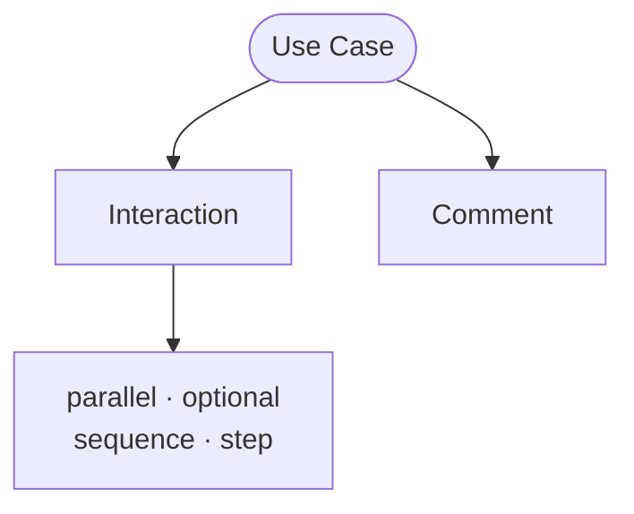

A use case is a definition found in an [epic](epic.md) that defines one way
a user might interact with the system. Use cases capture the step-by-step
interactions between users and system components.

## Purpose

Use cases in RIDDL serve several purposes:

- **Document user journeys**: Show how users accomplish goals
- **Define acceptance criteria**: Establish what "done" looks like
- **Generate sequence diagrams**: Visualize component interactions
- **Guide implementation**: Provide clear requirements for developers

## Syntax

A use case restates the user story, then lists its
[interaction](interaction.md) steps:

<!-- riddl: skip reason="illustrative fragment; references vocabulary this page does not define" -->
```riddl
epic UserAuthentication is {
  user Customer wants to "securely access their account"
  so that "they can view orders and manage settings"

  case SuccessfulLogin is {
    user Customer must "sign in"
    so that "they can view their orders"

    step focus user Customer on page Storefront.LoginPage
    step take form Storefront.Credentials from user Customer
    step send command Authenticate from user Customer to entity AuthService
    step show document Storefront.Dashboard to user Customer
  }

  case FailedLogin is {
    user Customer may "attempt to sign in with the wrong password"
    so that "they learn their credentials are wrong"

    step take form Storefront.Credentials from user Customer
    step send command Authenticate from user Customer to entity AuthService
    step entity AuthService refuses user Customer "credentials not recognized"
  }
}
```

Every step is introduced by the `step` keyword. Steps are **typed**: most name
real definitions rather than describing actions in prose, which is what lets
RIDDL check them.

## Step Kinds

| Step | Syntax |
|------|--------|
| Focus | `step focus <user> on <group>` |
| Direct | `step direct <user> to <url>` |
| Select | `step <user> selects <input>` |
| Take input | `step take <input> from <user>` |
| Show output | `step show <output> to <user>` |
| Refusal | `step <source> refuses <user> "<reason>"` |
| Send message | `step send <message> from <source> to <target>` |
| Self-processing | `step for <ref> is "<description>"` |
| Arbitrary | `step from <source> "<relationship>" to <target>` |
| Vague | `step is "<subject>" "<verb>" "<object>"` |

The **refusal** step is new in RIDDL 2.0. Before it, a system element
declining a user's request had no typed expression and had to be written as
free prose — which meant the most interesting branch of a use case was also
the least checkable.

The **arbitrary** and **vague** steps are the two that carry free prose rather
than typed references.

## Grouping Steps

Steps may be grouped to express ordering semantics:

```riddl
case Checkout is {
  user Customer wants to "pay" so that "the order ships"

  sequence {
    step take form Storefront.Payment from user Customer
    step send command Charge from user Customer to entity Billing
  }
  parallel {
    step send command ReserveStock from entity Billing to entity Inventory
    step send command NotifyWarehouse from entity Billing to entity Shipping
  }
  optional {
    step show document Storefront.GiftOptions to user Customer
  }
}
```

`sequence` steps happen in order, `parallel` steps in any order, and
`optional` steps may be skipped entirely.

## Happy Path vs. Alternatives

A complete epic typically includes a happy path, alternative paths that still
succeed, and error paths. The refusal step makes the last of these first-class:

```riddl
epic PlaceOrder is {
  user Customer wants to "purchase items in cart"
  so that "they receive products they need"

  case HappyPath   is { ??? }
  case OutOfStock  is { ??? }
  case PaymentFailed is { ??? }
}
```

## Validation

Because steps are typed, RIDDL can check whether the model actually supports
them. Two analyses run, both emitting **CompletenessWarnings** so they can
never fail a build:

**Witnessing** asks whether each step is supported by the model's structure:

- a `send` step whose receiver has no matching `on` clause, or no reachable
  [connector](connector.md) wiring from sender to receiver
- a `show output` step with no handler doing `put … to <output>`
- a `take`/`select input` step whose input type nothing consumes and no
  `get from input` reads

**Trace admissibility** asks whether the ordered sequence of steps is a legal
path through the state machines of the [entities](entity.md) it drives — a
message delivered to an entity in a state that does not handle it is not
admissible. Handling a message without changing state is fine; that is a
self-loop, not a gap.

A third check predicts whether a free-text step will be **AI-translatable**
into a generated test, by looking for its content words in the vocabulary
defined at or above the use case — definition names, `term` names and their
text, and `briefly`/`described as` prose. Richer in-scope terminology enlarges
that vocabulary and quiets the warning, which is the intended remedy.

!!! warning "Users interact only at the application boundary"
    For the two untyped step kinds — arbitrary and send-message — when exactly
    one side resolves to a [User](user.md), the other side must be a UI element
    or a definition whose enclosing context has the `application`
    [intention](context.md#intention). Otherwise it is an **Error**.

    The five dedicated user-interaction steps are compliant by construction,
    since they already hard-type their non-user side to a UI element or a URL.

## Relationship to Testing

Use cases directly inform acceptance tests. Each case can be translated into a
test scenario that verifies the system behaves as specified — which is what the
translatability prediction above is anticipating.

## Occurs In

* [Epics](epic.md)

## Contains



* [Interaction](interaction.md) — the steps, which may nest as `parallel`, `optional` or `sequence` groupings
* [Comment](comment.md)
* Its user story is required and is part of the case's declaration

